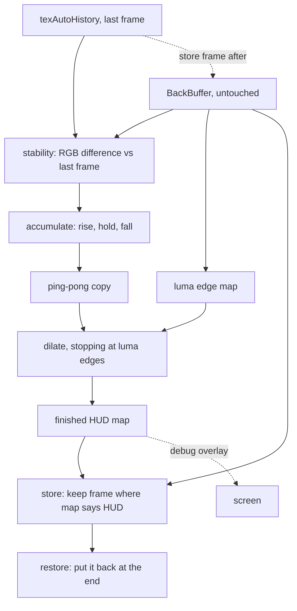

# Requirements

### Overview & Goals

A ReShade shader that builds its own UI mask by watching what **holds still**. A pixel the game keeps drawing in the same place, frame after frame, is HUD; a pixel the world is animating is not. When a menu is open its whole region holds still and lands in the mask; when it is closed that region shows moving world and drops out.

It is a standalone replacement for hand-authoring mask images. The companion project, `UIDetectMulti`, decides *when* a UI element is visible by sampling pixels you pick and decides *where* it is from a PNG you paint. This shader does neither: it needs no pixel coordinates, no mask image and no per-element configuration, and the mask it produces answers exactly one question per pixel — **is this HUD or not**.

**The shader is the feature.** There is no enable/disable switch: installing it turns it on.

### Relationship to `UIDetectMulti`

Written fresh from the design worked out against that pack, but sharing no code, no header and no configuration with it. The two are **alternatives, not companions**: both must be first in the effect list (to see the untouched back buffer) and last (to restore the masked pixels), so loading both means one of them reads a frame the other has already written into. That is left to the user to avoid rather than policed at runtime.

### Scope

**In Scope**

- One self-contained effectfile, `Shaders/AutoMask.fx`, with no companion header.
- One generated, full-screen HUD map, accumulated from frame-to-frame stability.
- Rise / hold / fall timing so a just-appeared or briefly-animating element stays covered.
- A luma edge map that stops the closing dilate at a real HUD contour.
- Its own store-and-restore pass pair, so it depends on no other effect's render target.
- A diagnostics view of the generated map.
- A stripped-down offline compile-and-cost check.
- README covering placement, tuning and the honest limits.

**Out of Scope**

- **Any authored configuration.** No pixel tables, no mask slots, no `UIDM_MASK_COUNT`, no header file. The only knobs are sliders with UI annotations, which belong in the ReShade panel rather than in a file the user edits and restarts.
- **Per-element control.** There are no elements. Either the shader protects what holds still or it does not.
- **Regions of interest.** The map covers the whole screen. Measured against the companion project's shipped masks, protected areas run to 36% (inventory) and 22.6% (settings) of the screen, so a hand-authored box would describe them worse than nothing.
- **A motion gate or a global freeze.** The world always carries motion — fire, trees, water, NPCs, the player character — so "the whole frame is still" is rare.
- **Telling elements apart.** One HUD/non-HUD boolean, not a per-element classification. Conflating health with inventory is accepted by design.
- **Semi-transparent UI.** Where the world shows through, the pixel is not stable, so it is never protected. Inherent to the signal, not tunable. Such elements stay with `UIDetectMulti`.
- **Preserving anything.** There is no shipped behaviour to keep byte-identical, so no baseline file and no variant matrix are needed.
- No build system beyond the offline check, no CI, no vendored ReShade headers.

### User Stories

- As a user who does not want to pick pixels or paint masks, I want to install one shader and have the UI protected, so that I can get on with playing.
- As a user with a big screen-filling panel (inventory, settings, dialog), I want the shader to protect whatever it is, so that I do not hand-author a third-of-the-screen mask.
- As a user calibrating this, I want to see the generated mask on screen, so that I can tell a genuine false positive from a semi-transparent element that will never work.
- As a user whose effects look wrong somewhere, I want to know when the shader is guessing and why, so that I can judge whether it or my tuning is at fault.

### Functional Requirements

1. **Stable is HUD.** A pixel whose colour has barely changed since the last frame accumulates toward mask; a pixel that keeps changing does not. Nothing else gates this — no rectangle, no camera-motion gate, no global freeze.
2. **Accumulated, not instantaneous.** Confidence rises while a pixel holds still, holds for a short grace period, then falls once it starts changing. So an element that just appeared is still covered, single-frame noise cannot punch holes in the mask, and an element that briefly animates or flickers does not drop out of it.
3. **Structure shapes the boundary, not the verdict.** Whether a pixel is mask comes from stability alone, so flat-shaded UI activates like any other — a HUD's flat bar fill is a near-black flat region and must not be rejected for being flat. The luma edge map is used only to stop the closing dilate at a real contour.
4. **One boolean, one map.** A single full-screen HUD/non-HUD value per pixel, in one full-resolution texture.
5. **Self-contained.** The shader stores and restores the masked pixels through its own render targets, so it does not depend on `UIDetectMulti` or any other effect.
6. **Diagnostics view.** With diagnostics on, the generated map is visible on screen so it can be compared against the game underneath.
7. **No file to edit.** All tuning is sliders in the ReShade panel with sensible defaults; a user never has to open the `.fx` to use it.

### Non-Functional Requirements

- **Cost is bounded and honest.** A small number of full-resolution passes per frame (accumulate, copy, dilate, store, restore). This is expensive for a `.fx` shader and the honest position is to say so in the README rather than hide it.
- **`.fx` constraints respected.** No compute shaders, no atomics, no mip generation, and never reading a render target while writing it — the accumulator must ping-pong with an explicit copy pass.
- **Memory.** Four full-resolution targets: the accumulator pair, the finished map, and the stored frame. ReShade allocates all of them unconditionally once the effect is compiled in, so the count is stated here and must be reviewed before implementation.
- **Conventions.** LF line endings, matching the companion pack's `.fx` style; HLSL comments short and sparse; no tutorial narration.
- **Licence.** MIT, with a credit line recording that the concept and the store/restore pattern come from Kaiser's `UIDetectMulti` and Brussels1's original work.

# Technical Design

### Why a standalone effectfile

The companion pack's 900 lines are almost entirely the slot apparatus: three elements per mask, five masks, each with its own PNG channel, timers and guards. With one boolean map covering the whole screen, all of it is unnecessary:

| Not needed here | Why |
| --- | --- |
| A companion `.fxh` | The header exists to hold authored tables — pixel coordinates, stored colours, mask count. This shader has none. |
| `UIDM_SLOT`, `UIDM_ELEM`, timer shaders, detect passes, `UIDM_MASK_COUNT` guards | No slots, no elements, no timers, no masks |
| Pixel tables, probe scanning, `UIDM_FirstRow` | No probes |
| Mask textures and samplers | Nothing to author |
| Per-element tolerances, activate/deactivate frames | There are no elements |
| A PNG-confinement helper | There is no PNG |
| `#if` scaffolding around every new block | Nothing to switch off, nothing to preserve |

The result is a plain HLSL shader: a few uniforms, four targets, four or five pixel shaders and two techniques.

### Pipeline



### Key Decisions

| Decision | Choice | Rationale |
| --- | --- | --- |
| Packaging | **One self-contained `.fx`, no header** | Sliders in the ReShade panel are better UX than a file the user edits and restarts, and there is no authored data that must live in a file. |
| Repository | **Standalone repo, MIT with credit** | Nothing here is entangled with the companion pack, and there is no shipped behaviour to preserve — so verification reduces to compile and cost, with no baseline. |
| Region of interest | **None — the map covers the whole screen** | Measured on the companion pack's real masks, protected areas reach 36% of the screen, so a box per element describes them worse than nothing. |
| Motion gate / freeze | **None** | The world always carries motion — fire, trees, water, NPCs, the player character — so a fully still frame is rare. |
| Activation signal | **Stability alone decides; structure shapes the boundary** | Scoring `stable * lerp(1, edge, weight)` rejected flat-shaded UI at the defaults, and most of a HUD is flat. Stability is the discriminator; the edge map's real value is geometry. |
| Confidence dynamics | **Asymmetric: rise, hold, then fall** | Rising covers interiors and tolerates a just-appeared element; the hold bridges brief animation (a draining bar, a scrolling grid); the fall clears a region once the world moves there again. |
| Storage | **Ping-pong pair of full-res targets plus an explicit copy pass** | Hard `.fx` constraint: a target cannot be read while written, and there are no atomics or compute shaders. |
| Edge closure | **Separable dilate (max) stopped by the luma edge map** | Anti-aliased boundaries and text need closing, and a dilate that stops at a luma step snaps the mask to the contour instead of growing a fixed radius into the scenery. |
| Where it runs | **Own store and restore passes, first and last** | ReShade's `.fx` dialect has no shared textures, so another effect's stored frame is unreachable. Being first is also what lets the accumulate pass see the untouched frame. |

### Data Models / Contracts

**Techniques** (`AutoMask.fx`), to be placed first and last respectively:

```
technique AutoMask          { ... }   // placed FIRST, before other effects
technique AutoMask_Restore  { ... }   // placed LAST, after other effects
```

**Uniforms** — one category, plain sliders with defaults, no annotations beyond the slider macro:

| Uniform | Meaning | Starting point |
| --- | --- | --- |
| `UIMaskEps` | RGB step counted as a change | a few of 255 |
| `UIMaskEdge` | luma step counted as a boundary | tens of 255 |
| `UIMaskRise` | confidence gained per still frame | small |
| `UIMaskFall` | confidence lost per changing frame | larger |
| `UIMaskForget` | frames of absence before decay starts | short |
| `UIMaskDilate` | closing radius in pixels | tiny; zero must be a pass-through |

**Render targets**

| Target | Size | Role |
| --- | --- | --- |
| `texAutoAccumA` / `texAutoAccumB` | full | ping-pong confidence, read one, write the other |
| `texAutoMap` | full | finished HUD map after gating and dilate |
| `texAutoHistory` | full | last frame, for the stability comparison |

### Proposed Changes

**1. `Shaders/AutoMask.fx`** — the whole shader. Pixel shaders:

- `PS_Accum` — sample `BackBuffer` and read `AutoHistory`; per pixel compute `stable` from the RGB max-difference against `UIMaskEps` (the whole activation signal) and `edge` from a central-difference luma gradient (used only by the dilate, never by the score); update confidence with rise → hold for `UIMaskForget` frames → fall. Read `texAutoAccumA`, write `texAutoAccumB`.
- `PS_Copy` — copy `B` back to `A`, the ping-pong back-edge.
- `PS_Dilate` — separable max over `UIMaskDilate`, stopping at a luma edge; a pass-through at radius zero.
- `PS_Store` — keep the live frame where the map says HUD, into `texAutoFrame`.
- `PS_StoreFrame` — copy the untouched frame into `texAutoHistory` for the next frame.
- `PS_Restore` — in the second technique: output the stored pixel where the map says HUD, the live pixel elsewhere.
- `PS_DebugMap` — the diagnostics overlay, plus its composite.

**2. Pass order inside `AutoMask`** — load-bearing:

1. `PS_Accum`, `PS_Copy`, `PS_Dilate` — build the map **before** the history store, because they compare the current frame against the *previous* frame; running them after the store would compare the frame against itself and every pixel would read as still.
2. `PS_Store`, keeping the mapped pixels.
3. `PS_StoreFrame`, copying the untouched frame into `texAutoHistory` for the next frame.
4. `PS_DebugMap` and its composite, last, and only when diagnostics are on.

**3. `AutoMask_Restore`** — a single pass running `PS_Restore`, so the masked pixels are put back on top after the user's other effects have run.

**4. Tooling** — a stripped-down check modelled on the companion project's `tools/verify_shaders.py`: fetch the pinned ReShade headers, preprocess, compile each pixel shader with `fxc`, and report instruction counts and opcode histograms. No baseline comparison, since there is no shipped behaviour to preserve; the point is "it compiles and here is what it costs".

`tools/pyproject.toml` exists only so `uv run` has a project to resolve — the tool itself uses the standard library alone. It sits in `tools/` rather than at the repo root because this is a shader project, not a Python one; `uv run` finds it by searching upward from the script, so `uv run tools/verify_shaders.py check` works from the root.

**5. `README.md`** — placement (first and last, and that it must not be loaded alongside `UIDetectMulti`), what each slider does, the diagnostics overlay, and the honest limits: semi-transparent UI is never protected, a quiet interior can accumulate, and it is the most expensive option in the pack next to the companion shader.

**6. `LICENSE`** — MIT, with the credit line for the concept and the store/restore pattern.

### File Structure

- `Shaders/AutoMask.fx` — the shader (new, the entire feature).
- `tools/verify_shaders.py` — the stripped-down compile-and-cost check (new).
- `tools/pyproject.toml` — the `uv` project the check runs under, deliberately inside `tools/` (new).
- `README.md` — placement, tuning, limits (new).
- `LICENSE` — MIT with credit (new).
- `.gitignore` — the tool's work directory.
- No `.fxh`, no `Textures/`, no mask PNGs.

### Risks

- **A quiet interior with no ambient animation.** Standing still facing a wall or a closed door, with nothing in frame moving, is the case the dropped defences used to cover: the wall accumulates and the effects drop out there. The failure is transient — the fast fall clears it as soon as the world moves again — and the diagnostics overlay shows it. Worth checking specifically in a quiet scene; if it matters, the minimal fix is a single global "require this much frame-wide motion" slider.
- **Sky and static backdrops.** Same mechanism as above, larger area.
- **HUD that animates more than briefly.** A draining bar or a scrolling grid needs the hold to bridge the animation, which makes `UIMaskForget` the most important slider rather than a nicety. Too short a hold means holes over exactly the parts that move.
- **Semi-transparent UI.** Where the world shows through, the pixel is not stable and never accumulates, so protection leaks there. Inherent, not tunable, and must be stated in the README rather than discovered.
- **Render-target cost.** Four full-resolution targets, allocated unconditionally once compiled in, plus five full-res passes a frame. Review before implementation rather than assuming it is free.
- **No containment at all.** With no ROI, no PNG and no per-element toggle, a false positive can appear anywhere and a wrong accumulation is a full-screen symptom. The diagnostics overlay and the tunables are the only recourse, which is why the overlay ships in the first version rather than later.
- **A wrong mask is worse than a wrong verdict.** A bad detection toggles at the wrong moment; a bad mask is continuously visible. Bias tuning toward precision — a longer hold and a tighter dilate rather than an eager mask.
- **Both shaders want the same two slots.** Loading this alongside the companion shader puts one of them second, where it reads a partly-processed frame. Left to the user by decision, so it must be stated plainly in the README.

# Testing

### Validation Approach

Everything here is checkable by an agent except the visual result in-game, and the split is stated honestly rather than blurred.

**Mechanically verifiable (agent):** that the shader compiles — the macros, the `tex2D` arguments, the pass bindings and the uniform annotations are all easy to get subtly wrong — and what it costs in instructions and passes.

**Not verifiable here:** whether the accumulated map actually isolates the game's HUD. That needs the two techniques loaded in ReShade in a game, walking with the HUD up, a menu open, standing still in a quiet room, and standing still somewhere with fire or water in view. Per the companion pack's guidance I will state that plainly instead of claiming verification.

### Key Scenarios

1. **It compiles.** Every pixel shader in both techniques, with diagnostics on and off, reports `ok` with no errors, and the check fails loudly if it produces no bytecode rather than reporting a clean pass — the failure mode the companion pack's tool was once bitten by.
2. **Pass bindings are what is intended.** The report lists the passes in the documented order, with the map built before the history store.
3. **Cost is recorded.** Instruction counts and opcode histograms for each shader, so the per-frame cost is a number rather than a claim.
4. **Zero radius is a pass-through.** With `UIMaskDilate = 0` the boundary pass must not change the map.
5. **`UIMaskForget = 0`** — decay starts immediately, so the hold is purely additive.

### Edge Cases

- **First frame / after a reset.** `texAutoHistory` and both accumulators start empty; confidence must start at zero rather than reading as a fully-formed mask on frame one.
- **Resolution change.** Targets are buffer-relative, so they must follow a resize rather than keep stale dimensions.
- **Nothing in the map.** With an empty map the restore pass must leave the frame untouched, not darken or overwrite it.
- **Everything in the map.** A fully-protected map should restore the whole screen, matching what a full-screen mask does in the companion pack.
- **Diagnostics off.** No diagnostics-only texture, target or sampler may be referenced outside its guard.

### Test Changes

**New `tools/verify_shaders.py`** — modelled on the companion pack's, but stripped: fetch the pinned ReShade headers into a work directory outside version control, patch in the `BUFFER_*` macros ReShade would inject, preprocess, compile each pixel shader with `fxc`, and report status, instruction count and opcode histogram. It must **fail loudly on missing data** rather than reporting success with no bytecode.

**Not added:** no unit tests. There is nothing to unit-test in a shader, and the companion pack deliberately has no test framework.

**Documentation to ship with it:** `README.md` covering placement (first and last, and not alongside `UIDetectMulti`), what each slider does, the diagnostics overlay, and the limits — semi-transparent UI, a quiet interior, and the cost.
