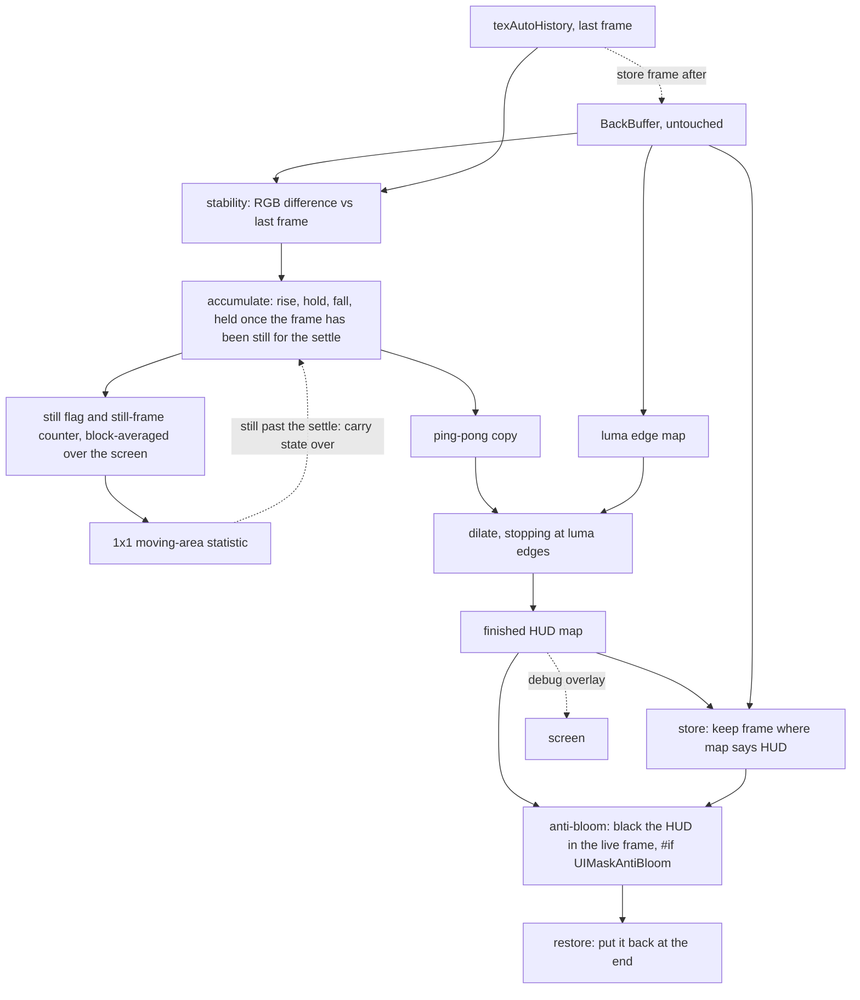

# Requirements

### Overview & Goals

A ReShade shader that builds its own UI mask by watching what **holds still**. A pixel the game keeps drawing in the same place, frame after frame, is HUD; a pixel the world is animating is not. When a menu is open its whole region holds still and lands in the mask; when it is closed that region shows moving world and drops out.

It is a standalone replacement for hand-authoring mask images. The companion project, `UIDetectMulti`, decides *when* a UI element is visible by sampling pixels you pick and decides *where* it is from a PNG you paint. This shader does neither: it needs no pixel coordinates, no mask image and no per-element configuration, and the mask it produces answers exactly one question per pixel — **is this HUD or not**.

**The shader is the feature.** There is no enable/disable switch: installing it turns it on.

### Relationship to `UIDetectMulti`

Written fresh from the design worked out against that pack, but sharing no code, no header and no configuration with it. The two are **alternatives, not companions**: both must be first in the effect list (to see the untouched back buffer) and last (to restore the masked pixels), so loading both means one of them reads a frame the other has already written into. That is left to the user to avoid rather than policed at runtime.

### Scope

**In Scope**

- One self-contained effectfile, `Shaders/AutoMask.fx`, with no companion header.
- One generated, full-screen HUD map, accumulated from frame-to-frame stability.
- Rise / hold / fall timing so a just-appeared or briefly-animating element stays covered.
- One frame-wide stillness gate: a tunable moving-area threshold below which, after a short settle, the map is held instead of advanced.
- A luma edge map that stops the closing dilate at a real HUD contour.
- Its own store-and-restore pass pair, so it depends on no other effect's render target.
- Anti-bloom suppression of the masked pixels, so bloom downstream does not pick the UI up.
- A diagnostics view of the generated map.
- A stripped-down offline compile-and-cost check.
- README covering placement, tuning and the honest limits.

**Out of Scope**

- **Any authored configuration.** No pixel tables, no mask slots, no mask count, no header file. Nothing to fill in: the defaults are correct out of the box, so a user never has to open the `.fx` even though the two structural switches (anti-bloom, diagnostics) are preprocessor definitions rather than live sliders.
- **Per-element control.** There are no elements. Either the shader protects what holds still or it does not.
- **Regions of interest.** The map covers the whole screen. Measured against the companion project's shipped masks, protected areas run to 36% (inventory) and 22.6% (settings) of the screen, so a hand-authored box would describe them worse than nothing.
- **A camera-motion gate, and a freeze that vetoes pixels.** The gate measures how much of the screen changed, not where the camera went, and it holds the accumulator rather than overriding a verdict. The world usually carries motion — fire, trees, water, NPCs, the player character — so a still frame is rare, and the gate is inert unless the world view genuinely stops being drawn.
- **Telling elements apart.** One HUD/non-HUD boolean, not a per-element classification. Conflating health with inventory is accepted by design.
- **Semi-transparent UI.** Where the world shows through, the pixel is not stable, so it is never protected. Inherent to the signal, not tunable. Such elements stay with `UIDetectMulti`.
- **Preserving anything.** There is no shipped behaviour to keep byte-identical, so no baseline file and no variant matrix are needed.
- No build system beyond the offline check, no CI, no vendored ReShade headers.

### User Stories

- As a user who does not want to pick pixels or paint masks, I want to install one shader and have the UI protected, so that I can get on with playing.
- As a user with a big screen-filling panel (inventory, settings, dialog), I want the shader to protect whatever it is, so that I do not hand-author a third-of-the-screen mask.
- As a user calibrating this, I want to see the generated mask on screen, so that I can tell a genuine false positive from a semi-transparent element that will never work.
- As a user running a bloom or glare pass, I want the masked UI out of the frame those effects see, so that my bloom does not bleed off the HUD and smear it across the scene.
- As a user standing still in a quiet room or staring at the sky, I want the shader to notice that nothing is moving and stop guessing, so that the effects do not drop out over the world in front of me.
- As a user whose effects look wrong somewhere, I want to know when the shader is guessing and why, so that I can judge whether it or my tuning is at fault.

### Functional Requirements

1. **Stable is HUD.** A pixel whose colour has barely changed since the last frame accumulates toward mask; a pixel that keeps changing does not. Nothing else in the per-pixel path gates this — no rectangle, no camera-motion gate, no per-pixel freeze. The one frame-wide exception is requirement 3: it can pause the accumulator, but it never changes a pixel's verdict.
2. **Accumulated, not instantaneous.** Confidence rises while a pixel holds still, holds for a short grace period, then falls once it starts changing. So an element that just appeared is still covered, single-frame noise cannot punch holes in the mask, and an element that briefly animates or flickers does not drop out of it.
3. **Frame-wide stillness holds the map.** The same frame-to-frame difference that decides each pixel is averaged over the screen. Below a tunable moving-area threshold the frame counts as still, and once it has been still for a short settle the accumulator carries its whole state over unchanged — no rise, no fall, no decay — so a quiet interior, a sky or a static backdrop cannot keep growing while the world view is not being drawn. The settle is what lets a panel that opens into an already-paused scene still be scanned for those first few frames before the map locks; freezing on the first still frame would protect only whatever was already accumulated. The measure is a fraction of the screen, not a camera estimate, and it never overwrites a per-pixel verdict.
4. **Structure shapes the boundary, not the verdict.** Whether a pixel is mask comes from stability alone, so flat-shaded UI activates like any other — a HUD's flat bar fill is a near-black flat region and must not be rejected for being flat. The luma edge map is used only to stop the closing dilate at a real contour.
5. **One boolean, one map.** A single full-screen HUD/non-HUD value per pixel, in one full-resolution texture.
6. **Self-contained.** The shader stores and restores the masked pixels through its own render targets, so it does not depend on `UIDetectMulti` or any other effect.
7. **Anti-bloom suppression.** The masked pixels are written black into the frame the rest of the effect chain sees, so a bloom pass downstream cannot pick the UI up and bleed it over the scene. It happens inside `AutoMask` and after the frame has been stored, so the real UI is still banked for the restore pass and the final image is unchanged — only what the effects in between see is blacked. Exactly the pack's arrangement: it banks the masked pixels, then a second pass in the same technique overwrites them with a constant black. The whole thing is inside `#if UIMaskAntiBloom` — pass, technique entry and shader — so with it compiled out nothing runs, the same way the pack removes it. It is the one structural switch that is on by default.
8. **Diagnostics view.** With diagnostics on, the generated map is visible on screen so it can be compared against the game underneath — together with whether the stillness gate is currently holding the map and what moving area it measured, since a gate that cannot be seen cannot be tuned. It is a compile-time switch, so with it off nothing of the overlay — passes, shaders or targets — is compiled or allocated.
9. **No file to edit.** Every value ships with a correct default, so a user never has to open the `.fx`. Tuning is sliders in the ReShade panel; the two structural switches are preprocessor definitions with the right default and a ReShade-level override, so setting them is optional and never required to use the shader.

### Non-Functional Requirements

- **Cost is bounded and honest.** Five full-resolution passes per frame in `AutoMask` — accumulate, the two ping-pong steps, the store and the history store — and one in `AutoMask_Restore`, plus two sub-resolution passes that average the still flag. Those two together cost well under one full-resolution pass, so the gate does not change the order of magnitude. Anti-bloom adds a sixth full-res pass and diagnostics add their own, but both are compile-time `#if` blocks: with either switched off the pass and its instructions are absent from the bytecode entirely, which is how the pack gets the 3x it documents for its before-technique. Every pass here is a full-res read and write, so the pass count — not the instruction count — is what the frame pays. This is expensive for a `.fx` shader and the honest position is to say so in the README rather than hide it.
- **`.fx` constraints respected.** No compute shaders, no atomics, no mip generation, and never reading a render target while writing it — the accumulator must ping-pong with an explicit copy pass.
- **Memory.** Six targets with diagnostics compiled out — five full-resolution (the accumulator pair, the map, the history and the stored frame) and one for the still-flag statistics — plus `texAutoDebug` when `UIMaskDiagnostics` is 1. ReShade allocates every declared target unconditionally, so what is declared is what is paid for; putting the diagnostics target inside its guard is what keeps the count down rather than merely the passes. The count is stated here and must be reviewed before implementation.
- **Conventions.** LF line endings, matching the companion pack's `.fx` style; HLSL comments short and sparse; no tutorial narration, with the file header below as the one exception.
- **Licence.** MIT, with a credit line recording that the concept and the store/restore pattern come from Kaiser's `UIDetectMulti` and Brussels1's original work, and that the anti-bloom pass follows the pack's `UIDM_ANTIBLOOM`. The same credit appears in short form in the shader's own header block, not only in `LICENSE`, so it travels with the file if someone copies just the `.fx` into their ReShade folder.

# Technical Design

### Why a standalone effectfile

The companion pack's 900 lines are almost entirely the slot apparatus: three elements per mask, five masks, each with its own PNG channel, timers and guards. With one boolean map covering the whole screen, all of it is unnecessary:

| Not needed here | Why |
| --- | --- |
| A companion `.fxh` | The header exists to hold authored tables — pixel coordinates, stored colours, mask count. This shader has none. |
| `UIDM_SLOT`, `UIDM_ELEM`, timer shaders, detect passes, `UIDM_MASK_COUNT` guards | No slots, no elements, no timers, no masks |
| Pixel tables, probe scanning, `UIDM_FirstRow` | No probes |
| Mask textures and samplers | Nothing to author |
| Per-element tolerances, activate/deactivate frames | There are no elements |
| A PNG-confinement helper | There is no PNG |
| `#if` scaffolding around every block | Nothing to preserve, and only two blocks to switch off: the anti-bloom pass and the diagnostics overlay. Both are guarded, not authored. |

The result is a plain HLSL shader: a few sliders, two compile-time switches, seven targets (five of them full resolution) and a handful of pixel shaders across two techniques. The guards exist only where eliding the pass is the point.

### Pipeline



### Key Decisions

| Decision | Choice | Rationale |
| --- | --- | --- |
| Packaging | **One self-contained `.fx`, no header** | There is no authored data that must live in a file — no coordinates, colours or tables — so a companion header would hold nothing. Tuning values are live sliders; the two structural switches are preprocessor definitions, which is what lets their passes be elided from the bytecode. |
| Knob mechanism | **Live slider for values tuned by watching, compile-time `#if` for the two structural switches** | A uniform is unknown at compile time, so the compiler has to keep every path reachable and a disabled feature still costs its full-res pass. A definition is known before compilation, so a guarded block vanishes outright. Anti-bloom and diagnostics are set once and their passes are the whole cost, which is where the specialisation pays; the stability, timing and gate values are adjusted against the overlay and stay live. |
| Repository | **Standalone repo, MIT with credit** | Nothing here is entangled with the companion pack, and there is no shipped behaviour to preserve — so verification reduces to compile and cost, with no baseline. The credit line names the pack for the concept, the store/restore pattern and the anti-bloom pass. |
| Region of interest | **None — the map covers the whole screen** | Measured on the companion pack's real masks, protected areas reach 36% of the screen, so a box per element describes them worse than nothing. |
| Stillness gate | **A frame-wide moving-area threshold holds the accumulator; per-pixel stability still decides every verdict** | The world usually carries motion, so a still frame means the world view is not being drawn and anything that looks stable is stable for the wrong reason. The measure is the same frame-to-frame difference the mask already uses, averaged over the screen, so it needs no camera and reads as a percentage the overlay can show. The hold starts after a short settle so a panel opening into a paused scene is still scanned before the map locks. Low by default, and zero turns it off. |
| Activation signal | **Stability alone decides; structure shapes the boundary** | Scoring `stable * lerp(1, edge, weight)` rejected flat-shaded UI at the defaults, and most of a HUD is flat. Stability is the discriminator; the edge map's real value is geometry. |
| Confidence dynamics | **Asymmetric: rise, hold, then fall** | Rising covers interiors and tolerates a just-appeared element; the hold bridges brief animation (a draining bar, a scrolling grid); the fall clears a region once the world moves there again. |
| Storage | **Ping-pong pair of full-res targets plus an explicit copy pass** | Hard `.fx` constraint: a target cannot be read while written, and there are no atomics or compute shaders. |
| Anti-bloom | **Black the masked pixels in the live frame, inside `AutoMask` and after the store** | A bloom pass downstream finds the UI still in the frame and bleeds it over the scene; writing black there takes the source away. It runs after the store deliberately, so what is banked for the restore pass is the real UI and the final image is unchanged. The mechanism is the pack's: a pass that writes `lerp(0, frame, map)`, a constant black behind the mask and the frame everywhere else. There is no blur or feather in it, here or in the pack — the blend is proportional to the mask value, so all the softness there is comes from the mask itself. |
| Edge closure | **Separable dilate (max) stopped by the luma edge map** | Anti-aliased boundaries and text need closing, and a dilate that stops at a luma step snaps the mask to the contour instead of growing a fixed radius into the scenery. |
| Where it runs | **Own store and restore passes, first and last** | ReShade's `.fx` dialect has no shared textures, so another effect's stored frame is unreachable. Being first is also what lets the accumulate pass see the untouched frame. |

### Data Models / Contracts

**Techniques** (`AutoMask.fx`), to be placed first and last respectively:

```
technique AutoMask          { ... }   // placed FIRST, before other effects
technique AutoMask_Restore  { ... }   // placed LAST, after other effects
```

**Uniforms** — one category, plain sliders with defaults, no annotations beyond the slider macro. All of these are live, because each is a value you tune by watching the overlay:

| Uniform | Meaning | Starting point |
| --- | --- | --- |
| `UIMaskEps` | RGB step counted as a change | a few of 255 |
| `UIMaskEdge` | luma step counted as a boundary | tens of 255 |
| `UIMaskRise` | confidence gained per still frame | small |
| `UIMaskFall` | confidence lost per changing frame | larger |
| `UIMaskForget` | frames of absence before decay starts | short |
| `UIMaskDilate` | closing radius in pixels | tiny; zero must be a pass-through |
| `UIMaskMotion` | percent of the screen that must be moving for a frame to count as live; below it the map is held | low, single digits; zero turns the gate off |
| `UIMaskSettle` | still frames tolerated before the hold starts, so a panel opening into a paused scene is still scanned | short |

**Compile-time definitions** — declared with `#ifndef` in the shader, so a ReShade-level definition or a preset can set them without editing the file:

| Definition | Meaning | Default |
| --- | --- | --- |
| `UIMaskAntiBloom` | compile in the anti-bloom pass | `1` |
| `UIMaskDiagnostics` | compile in the diagnostics overlay | `0` |

Both are structural: the guard covers everything the feature owns — the shader body, the pass, its entry in the technique, and any `texture`/`sampler` declaration only that feature uses — so with a definition at `0` the pass does not run and nothing it owns is allocated or compiled. Anti-bloom has no exclusive target (it reads and writes the live frame and consults the map the store and restore passes need), so its guard buys bandwidth; the diagnostics overlay's two targets are exclusive to it, so its guard buys memory too. Every other knob is a live slider, because it is tuned by watching the overlay and a recompile per adjustment would be the wrong trade.

**Render targets**

| Target | Size | Role |
| --- | --- | --- |
| `texAutoAccumA` / `texAutoAccumB` | full | ping-pong per-pixel state — confidence in `.r`, the hold counter in `.g`, the still flag in `.b`, the still-frame counter in `.a` — read one, write the other |
| `texAutoMap` | full | finished HUD map after gating and dilate |
| `texAutoHistory` | full | last frame, for the stability comparison |
| `texAutoFrame` | full | the live frame kept where the map says HUD, read back by the restore pass |
| `texMotionCoarse` | 1/16 | block average of the per-pixel still flag |
| `texMotionStat` | 1×1 | the frame's moving-area fraction, compared against `UIMaskMotion` |
| `texAutoDebug` | full | the diagnostics map, painted on its own so the overlay pass can blend it over the frame |

Anti-bloom needs no target of its own: it reads the live frame and writes it back, and the map it consults is one the store and restore passes need anyway. `texAutoDebug` is the only target that belongs to one feature, so it is declared inside `#if UIMaskDiagnostics` and is not allocated at all when it is off — the pack guards its diagnostics targets the same way. Declaring a target inside the guard is the one place the "no authored data" rule and the compile-time switches meet.

The overlay reads `BackBuffer` for the frame rather than keeping a copy of it. It runs after `PS_StoreFrame`, so the frame is still untouched at that point and `texAutoHistory` already holds its copy: a second full-resolution target just to hold the frame again would buy nothing.

### Proposed Changes

**1. `Shaders/AutoMask.fx`** — the whole shader, opening with a header block in the companion pack's ruled style:

```hlsl
//++++++++++++++++++++++++++++++++++++++++++++++++++++++++++++++++++++++++++++++++++++++++++++++++++++
//
// AutoMask
// License: MIT (see LICENSE)
// Concept, store/restore pattern and anti-bloom from UIDetectMulti by Kaiser,
// which builds on work by Brussels1. https://github.com/Kaiser-R/Reshade-Shaders
//
//++++++++++++++++++++++++++++++++++++++++++++++++++++++++++++++++++++++++++++++++++++++++++++++++++++
```

That block is the only long comment in the file — the rule about short, sparse comments holds everywhere below it, and there is no per-function attribution or narration. Note what it does *not* claim: this shader shares no code with the pack, so the wording credits the concept and the two borrowed mechanisms rather than describing a derivation, and it names the upstream repo rather than only the author. Pixel shaders:

- `PS_Accum` — sample `BackBuffer` and read `AutoHistory`; per pixel compute `stable` from the RGB max-difference against `UIMaskEps` (the whole per-pixel activation signal) and `edge` from a central-difference luma gradient (used only by the dilate, never by the score); update confidence with rise → hold for `UIMaskForget` frames → fall, and write the raw still flag into `.b`. Read `texAutoAccumA`, write `texAutoAccumB`. It also reads the 1×1 `texMotionStat`: while that fraction is under `UIMaskMotion` the still-frame counter in `.a` rises, and once it passes `UIMaskSettle` the frame is held — confidence and hold counter written back untouched, no rise and no decay. Below the settle it behaves normally, which is the few frames a panel opening into an already-still scene needs to land in the map before the gate locks.
- `PS_Motion` — block-average the still flag out of `texAutoAccumB` into the sixteenth-size `texMotionCoarse`.
- `PS_MotionAvg` — reduce that to the 1×1 `texMotionStat` the next frame's `PS_Accum` reads. Two sub-resolution passes, together well under one full-resolution pass in cost.
- `PS_Copy` — copy `B` back to `A`, the ping-pong back-edge.
- `PS_Dilate` — separable max over `UIMaskDilate`, stopping at a luma edge; a pass-through at radius zero.
- `PS_Store` — keep the live frame where the map says HUD, into `texAutoFrame`.
- `PS_StoreFrame` — copy the untouched frame into `texAutoHistory` for the next frame.
- `PS_AntiBloom` — output `lerp(0, live frame, map)`: where the map says HUD the pixel is constant black, everywhere else it is the frame already rendered. That is the whole pass the pack runs under `UIDM_ANTIBLOOM`, and it is what takes the UI away as a bloom source. No blur, no feather, no radius — the pack's blend is the same proportional lerp against the mask value, so any softness in the result is the mask's, and ours is the map's. There is no runtime switch inside it: the whole pass, and its entry in the technique, sit inside `#if UIMaskAntiBloom`, so with the definition at 0 there is no pass to run and nothing to branch on. It sits after `PS_Store`, so what the restore pass puts back is still the real UI.
- `PS_Restore` — in the second technique: output the stored pixel where the map says HUD, the live pixel elsewhere.
- `PS_DebugMap` — paints the diagnostics map into its own target: the mask, whether the gate is holding this frame, and the moving area measured against the threshold.
- `PS_DebugOverlay` — blends that map over the frame, so the game underneath is still recognisable: the same two-pass shape as the pack's `PS_AutoDebug` into `texAutoDebug` followed by `PS_AutoComposite`. Both are guarded whole, like the anti-bloom pass: `#if UIMaskDiagnostics` covers the shaders, the passes, their entries in the technique and their target. The pair can collapse into a single pass with no target at all; that is written up as a deferred option below.

**2. Pass order inside `AutoMask`** — load-bearing:

1. `PS_Accum` — builds the new confidence from the current frame against the *previous* one, **before** the history store; running it after the store would compare the frame against itself and every pixel would read as still. It reads the statistic the previous frame left behind, which is what gives the gate its one-frame delay.
2. `PS_Motion`, `PS_MotionAvg` — average the still flag `PS_Accum` has just written. They run after it because that flag is their only input, and their output is read on the *next* frame, so a held frame takes effect one frame after the motion actually stopped. One frame of latency is invisible here, and it is what keeps every pass reading only targets it is not writing.
3. `PS_Copy`, `PS_Dilate` — the ping-pong back-edge and the boundary close, also before the store.
4. `PS_Store`, keeping the mapped pixels.
5. `PS_StoreFrame`, copying the untouched frame into `texAutoHistory` for the next frame.
6. `PS_AntiBloom` — blacks the masked pixels in the live frame, and it has to come **after** the store rather than before it: the store is what keeps the real UI for the restore pass, so blacking earlier would bank the black instead. The whole pass and its entry in the technique are inside `#if UIMaskAntiBloom`, so this step exists only when the definition is 1.
7. `PS_DebugMap` then `PS_DebugOverlay`, last, and only when diagnostics are on — where "on" is a compile-time definition, not a runtime check, so with `UIMaskDiagnostics` at 0 neither pass nor either shader is compiled.

**3. `AutoMask_Restore`** — a single pass running `PS_Restore`, so the masked pixels are put back on top after the user's other effects have run. Between the two techniques the masked pixels are black, which is invisible to the user — the restore pass has the real ones — and is exactly what stops a bloom pass picking them up.

**4. Tooling** — a stripped-down check modelled on the companion project's `tools/verify_shaders.py`: fetch the pinned ReShade headers, preprocess, compile each pixel shader with `fxc`, and report instruction counts and opcode histograms. Because two switches are compile-time, the check compiles each definition combination — `UIMaskAntiBloom` and `UIMaskDiagnostics` each at 0 and 1 — and reports the pass list it finds in the technique bodies, so a guard that drops a pass shows up as a missing pass rather than as a silent pass. No baseline comparison, since there is no shipped behaviour to preserve; the point is "it compiles, here is the pass list and here is what it costs".

`tools/pyproject.toml` exists only so `uv run` has a project to resolve — the tool itself uses the standard library alone. It sits in `tools/` rather than at the repo root because this is a shader project, not a Python one; `uv run` finds it by searching upward from the script, so `uv run tools/verify_shaders.py check` works from the root.

**5. `README.md`** — placement (first and last, and that it must not be loaded alongside `UIDetectMulti`), what each slider does, the anti-bloom switch and what it is for — including that it is a definition, so changing it recompiles — the diagnostics overlay, and the honest limits: semi-transparent UI is never protected, the stillness gate and its settle are the answer to a quiet interior, and it is the most expensive option in the pack next to the companion shader.

**6. `LICENSE`** — MIT, with the credit line for the concept, the store/restore pattern and the anti-bloom pass. The shader header repeats its essential half, since `LICENSE` can be separated from the `.fx` by a copy.

### File Structure

- `Shaders/AutoMask.fx` — the shader (new, the entire feature).
- `tools/verify_shaders.py` — the stripped-down compile-and-cost check (new).
- `tools/pyproject.toml` — the `uv` project the check runs under, deliberately inside `tools/` (new).
- `README.md` — placement, tuning, limits (new).
- `LICENSE` — MIT with credit (new).
- `.gitignore` — the tool's work directory.
- No `.fxh`, no `Textures/`, no mask PNGs.

### Risks

- **A quiet interior with no ambient animation.** Standing still facing a wall or a closed door, with nothing in frame moving, is the case the stillness gate exists for: once the settle has passed the map is held, so the wall stops accumulating and the effects come back there. The gate is the defence now, and the remaining exposure is the settle itself — a scene that goes still for only a moment still gets that moment of accumulation. The diagnostics overlay shows the gate holding, so a wrong freeze is visible rather than inferred.
- **Sky and static backdrops.** Same mechanism as above, larger area, and the gate covers them for the same reason.
- **A menu over a paused world, and the settle.** A panel that opens in a scene the game has already stopped is the one case where the gate and the signal disagree: the frame is still, but not because there is nothing there. The settle is the whole answer — long enough for the panel to be scanned. Too long and a genuinely empty room keeps accumulating for that window, and nothing separates the two cases, because a paused world and a quiet room are identical to this shader.
- **HUD that animates more than briefly.** A draining bar or a scrolling grid needs the hold to bridge the animation, which makes `UIMaskForget` the most important slider rather than a nicety. Too short a hold means holes over exactly the parts that move.
- **Semi-transparent UI.** Where the world shows through, the pixel is not stable and never accumulates, so protection leaks there. Inherent, not tunable, and must be stated in the README rather than discovered.
- **Render-target cost.** Six targets with diagnostics compiled out: the five full-resolution ones, plus the sixteenth-size still-flag average and the 1×1 statistic. Diagnostics add one more full-resolution target when compiled in. Because the declaration itself is guarded, its switch controls what is allocated and not only what runs — anti-bloom's guard buys bandwidth (its pass and its read/write go away) and the diagnostics guard buys memory as well (its target is never declared). Review before implementation rather than assuming it is free.
- **No containment at all.** With no ROI, no PNG and no per-element toggle, a false positive can appear anywhere and a wrong accumulation is a full-screen symptom. The diagnostics overlay and the tunables are the only recourse, which is why the overlay ships in the first version rather than later.
- **A wrong mask is worse than a wrong verdict.** A bad detection toggles at the wrong moment; a bad mask is continuously visible. Bias tuning toward precision — a longer hold and a tighter dilate rather than an eager mask.
- **Both shaders want the same two slots.** Loading this alongside the companion shader puts one of them second, where it reads a partly-processed frame. Left to the user by decision, so it must be stated plainly in the README.
- **The black step at the HUD contour.** Bloom keys on contrast, and black against a bright scene is contrast. Suppression removes the UI as a bloom source, but the boundary where the black meets the scene is itself an edge, so this trades a bleeding UI for a contour that can still glow. Neither implementation blurs that edge: the pack's blend is `lerp(colorOrig, color, maskChan)`, exactly proportional to the mask value, its sampler carries no filter override, and its masks were hard-edged in practice — so the step is the mask's own edge and nothing softens it. Ours is the same, over a map that is hard by construction. Softness would have to come from the source rather than the pass, and a way to give the anti-bloom pass a soft source from the confidence field is written up as a deferred option below.

### Deferred Options

Considered while designing and deliberately left out of the first version, each with the evidence that
would justify revisiting it. None of this is part of the implementation, and none of it is a bug in
what is specified above — the first version is meant to be watched running in a game before any of
these are revisited.

**A soft map for the anti-bloom pass only.** The step from constant black back to a bright scene is
itself contrast, so bloom can still find an edge at the HUD contour. Nothing in either implementation
blurs it — the pack's blend is `lerp(colorOrig, color, maskChan)`, exactly proportional to the mask
value, over a default unfiltered sampler, and its masks were hard-edged in practice — so the only
softness available comes from the source: the mask there, the map here, and this map is hard by
construction.

The accumulator already holds a continuous confidence field, so a feather is available without a new
pass or a new target. The variant is a second read of the confidence channel in `PS_AntiBloom` and a
`lerp` weighted by it in place of the binary map value, leaving that pass one sample heavier. It is not
in the first version for two reasons:

- **It is unproven.** Whether the contour is worth softening on a bright HUD over a bright scene has
  not been looked at in a game, and guessing wrong in a shader whose whole point is that it needs no
  hand-configuration is the failure this project exists to avoid.
- **It would soften the wrong thing if reused.** Anti-bloom is the only consumer that wants a soft
  value. The store and restore passes want the hard map — an intermediate value there is a partially
  protected pixel, which blurs the UI itself rather than the transition around it.

**What would settle it.** A screen capture of a bright HUD over a bright scene with bloom active: if
that contour glows, the soft map is worth trying and the change is small; if it does not, the pass
stays as it is and this stays a note.

**Collapsing the diagnostics overlay into a single pass.** As specified the overlay is two passes:
`PS_DebugMap` paints the map into `texAutoDebug`, then `PS_DebugOverlay` blends that over the frame.
It can be one pass with no target at all — compute the map inline and return
`lerp(frame, map, 0.7)` from a single shader, dropping both the `texAutoDebug` target and the pass
that fills it. The pack splits it the same way, for the same reason: `PS_AutoDebug` reads
`AutoHistory`, which in its pipeline is read and rewritten within the one technique, so it has to
capture the comparison state before the store pass runs. This shader's map is a rendered target rather
than an inline computation, so once the map exists the extra pass and the extra target are only there
to hold it and put it back.

The output is the same, so this is a pure cost change: one fewer full-resolution target allocated and
one fewer pass per frame, on a feature that is off by default. The ordering that matters is preserved
either way — the overlay still has to run after `PS_StoreFrame`, so that the frame it blends over is
the untouched one and `texAutoHistory` holds a clean copy for the next comparison.

It is left undone deliberately. Tuning the mask is the part that needs eyes on it, and it happens with
diagnostics on, so the overlay is the last thing worth optimising before the implementation has been
seen running at all — the version that runs and can be watched is worth more than the version that is
one pass cheaper and has not been loaded in a game yet. Revisit once the shader is in front of a game.

# Testing

### Validation Approach

Everything here is checkable by an agent except the visual result in-game, and the split is stated honestly rather than blurred.

**Mechanically verifiable (agent):** that the shader compiles — the macros, the `tex2D` arguments, the pass bindings and the uniform annotations are all easy to get subtly wrong — and what it costs in instructions and passes.

**Not verifiable here:** whether the accumulated map actually isolates the game's HUD. That needs the two techniques loaded in ReShade in a game, walking with the HUD up, a menu open, standing still in a quiet room, standing still somewhere with fire or water in view, and opening a menu in a scene the game has already paused — the one case where the stillness gate and the signal disagree, and so the one that decides how long the settle should be. Per the companion pack's guidance I will state that plainly instead of claiming verification.

### Key Scenarios

1. **It compiles.** Every pixel shader in both techniques reports `ok` with no errors, in each definition combination that matters: `UIMaskAntiBloom` on and off, `UIMaskDiagnostics` on and off. A guard that silently drops a pass from the technique is exactly the kind of mistake this catches, and the check fails loudly if it produces no bytecode rather than reporting a clean pass — the failure mode the companion pack's tool was once bitten by.
2. **Pass bindings are what is intended.** The report lists the passes in the documented order, with the map built before the history store and the still-flag average after the accumulate.
3. **Cost is recorded.** Instruction counts and opcode histograms for each shader, so the per-frame cost is a number rather than a claim. The pass list is reported per definition combination too, so the elision the guards are there for is visible as a missing pass rather than assumed.
4. **Zero radius is a pass-through.** With `UIMaskDilate = 0` the boundary pass must not change the map.
5. **`UIMaskForget = 0`** — decay starts immediately, so the hold is purely additive.
6. **`UIMaskMotion = 0`** — the gate is off and nothing is ever held, so a fully still frame accumulates exactly as it did before the gate existed.
7. **`UIMaskSettle = 0`** — the hold starts on the first still frame, and a scene that never goes still is unaffected by either slider.
8. **Anti-bloom off** — with `UIMaskAntiBloom` at 0 the pass is absent from the technique body, not merely inert, and the restore pass still produces the same image as it would with the pass present.
9. **Anti-bloom matches the pack.** With it compiled in, a masked pixel in the live frame is exactly black and an unmasked one is exactly the frame — the same output the pack's `PS_Antibloom` produces, checked by inspection rather than assumed.
10. **Diagnostics off** — with `UIMaskDiagnostics` at 0 neither overlay pass nor either shader is compiled, and no diagnostics-only sampler remains in the bytecode at all.

### Edge Cases

- **First frame / after a reset.** `texAutoHistory` and both accumulators start empty; confidence must start at zero rather than reading as a fully-formed mask on frame one.
- **Resolution change.** Targets are buffer-relative, so they must follow a resize rather than keep stale dimensions.
- **Nothing in the map.** With an empty map the restore pass must leave the frame untouched, not darken or overwrite it.
- **Everything in the map.** A fully-protected map should restore the whole screen, matching what a full-screen mask does in the companion pack.
- **Diagnostics off.** With `UIMaskDiagnostics` at 0 no diagnostics-only texture, target or sampler may be referenced outside its guard — the guard wraps the declarations as well as the shader and the pass, so nothing diagnostics-only is allocated and no sampler survives in the bytecode.
- **The motion statistic starts empty.** `texMotionStat` is zero on frame one, so the frame reads as perfectly still; the still-frame counter must start at zero too, so the settle has to run before the gate can lock a mask that has not been built yet.
- **The gate is one frame behind.** A frame that has just gone still is still processed, and the hold begins the frame after its statistic lands. That latency is deliberate — it is what keeps every pass reading a target it is not writing.
- **Anti-bloom and the stored frame.** The anti-bloom pass runs after `PS_StoreFrame`, so what is banked for the restore pass is the untouched frame. Running it before the store would restore black over the UI — the pass order here is as load-bearing as the map-before-history one.

### Test Changes

**New `tools/verify_shaders.py`** — modelled on the companion pack's, but stripped: fetch the pinned ReShade headers into a work directory outside version control, patch in the `BUFFER_*` macros ReShade would inject, preprocess, compile each pixel shader with `fxc`, and report status, instruction count and opcode histogram. It must **fail loudly on missing data** rather than reporting success with no bytecode.

**Not added:** no unit tests. There is nothing to unit-test in a shader, and the companion pack deliberately has no test framework.

**Documentation to ship with it:** `README.md` covering placement (first and last, and not alongside `UIDetectMulti`), what each slider does — including the stillness gate and its settle, which trade a little accumulation for a freeze and are the one pair of knobs with no setting that is right for every scene — the diagnostics overlay, and the limits: semi-transparent UI and the cost.
