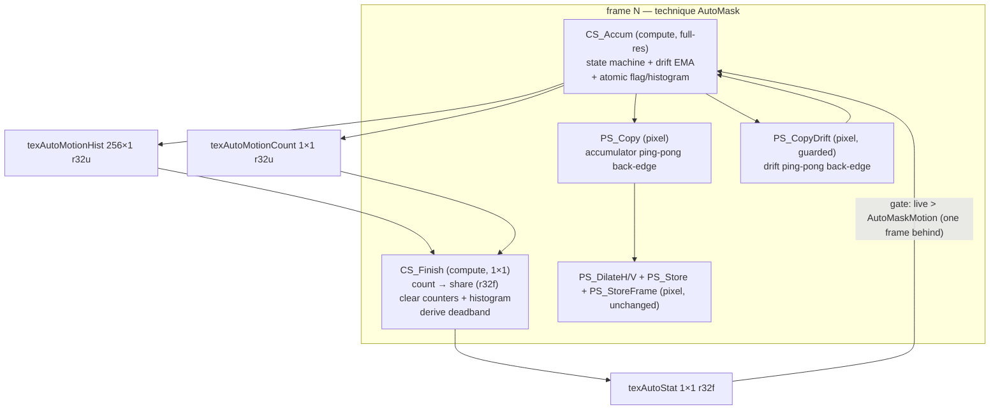

# Requirements

### Overview & Goals

Add a guarded compute-shader bundle to `Shaders/AutoMask.fx` behind a third structural preprocessor switch (`AutoMaskCompute`), delivering three things the pixel-shader path cannot:

1. **An exact world-drawn gate** — every pixel counted via `atomicAdd` with a `groupshared` per-group reduction, replacing the 16×16 coarse/avg approximation (`PS_Motion`/`PS_MotionAvg`, 1,024 taps standing in for ~3.7M pixels).
2. **The EMA drift channel** — a long-baseline color history that sees slow backdrop motion (the slow-skybox failure) that the frame-to-frame 8-bit comparison reads as exactly zero.
3. **A change-size histogram** — 256 `atomicAdd` bins that can auto-derive `AutoMaskEps` from the measured noise floor instead of manual tuning.

The compute path is a **replacement, not an addition**: roughly cost-neutral GPU time, one fewer full-res pass pair, statistic no longer lagging a stage behind. Off by default and effectively free when off (guarded-out shaders never compile, guarded-out targets never allocate).

**Pixel-shader-only EMA later: yes.** The drift logic is isolated in a small guarded block per this plan (one sample, one lerp, one max into the motion flag), sharing the uniforms and pass slots, so a later delivery can mirror it into `PS_Accum` behind its own guard for D3D9/D3D10 users — a small mechanical lift, not a redesign.

### Scope

**In scope**
- `AutoMaskCompute` preprocessor switch, same `#ifndef` + `// [0 or 1]` convention as `AutoMaskAntiBloom`/`AutoMaskDiagnostics`, guarding its shaders, pass entries, and compute-only targets.
- `CS_Accum`: the identical per-pixel state machine as `PS_Accum` plus the coverage/histogram atomics.
- `CS_Finish`: a 1×1-thread pass right after `CS_Accum` that writes the share statistic (float, readable by the existing pixel passes) and clears the counters/histogram each frame.
- EMA drift channel: packed in two new full-res RGBA16F ping-pong targets, one new duration slider (`AutoMaskDrift`, "Drift horizon (seconds)", drag widget per the frame-count convention).
- Histogram + auto-deadband: `AutoMaskAutoStep` bool toggle; on, the deadband is overridden per frame by the histogram's noise floor (`AutoMaskNoiseFloor` percent slider); off, `AutoMaskEps` rules exactly as today.
- `tools/verify_shaders.py`: compute-entry compilation (`cs_5_0`), `ComputeShader`/`DispatchSizeX/Y/Z` pass parsing, and the variant matrix extended to both switch settings.
- README updates in the same voice, per stage.

**Out of scope**
- A pixel-shader-only EMA fallback variant (deliberately deferred; see above).
- Any change to the two-technique contract, pass order semantics, or the anti-bloom/restore passes (they stay pixel passes — compute cannot write the back buffer).
- Block matching / optical flow.
- D3D9/D3D10 support for the compute path (inherent; documented as a limit).

### User Stories

- As a player in a game with a slowly panning skybox, I want the backdrop to stay out of the mask while my HUD stays in, so my effects don't grade the sky as interface.
- As a user on D3D9 or with a GPU without compute, I want the shader to behave exactly as today when `AutoMaskCompute` is off, with no VRAM or frame-time cost.
- As a user who hates hand-tuning noise thresholds, I want an opt-in auto-deadband that measures the scene's noise floor and sets the RGB step for me.
- As a tuning user, I want the overlay and corner marker to keep their current meanings so my existing tuning habits carry over.

### Functional Requirements

- `AutoMaskCompute=0` (default): the file compiles to the current behaviour byte-for-byte (checked via the verifier's bytecode hashes); no new targets allocated; no compute passes in the technique.
- `AutoMaskCompute=1`: the accum, motion-reduction pair, and their pass entries are replaced by the compute equivalents; all other passes (`PS_Copy`, dilation, `PS_Store`, `PS_StoreFrame`, anti-bloom, diagnostics, restore) unchanged.
- The world-drawn gate reads an exact share of changing pixels from the previous frame (same one-frame-behind semantics as today, same `> AutoMaskMotion` strictness, same magenta/yellow marker).
- The drift channel marks a pixel moving when **either** the frame-to-frame diff or the EMA-lag diff crosses the deadband; the graded overlay shows the max, so red remains the reading the verdict comes from.
- The deadband override is per frame, per shader invocation, and never writes back into the slider's value.
- New uniforms follow the annotation/type and widget-family conventions (`__UNIFORM_DRAG_FLOAT1` for the horizon, `__UNIFORM_SLIDER_BOOL1` for the toggle, slider for the noise floor).

### Non-Functional Requirements

- **Cost when on:** ~1 full-res compute pass replacing two sub-res passes + one 1-thread pass; `groupshared` reduction keeps global atomics at ~group count (thousands, not millions) per frame; histogram adds a 256-bin `r32u` (1 KB). Drift targets: two RGBA16F full-res ping-pong targets (~28 MB at 1440p) — identical cost to the pixel-shader EMA variant, since the EMA is a float read-modify-write either way.
- **Cost when off:** none beyond parse time; verified by target-declaration audit and the unchanged bytecode hashes.
- **Platform:** compute path requires D3D11+/Vulkan (SM5+; atomics are empty code below SM5 and rgba16f typed UAV load is unavailable below D3D11.1). README states this plainly, as the pack documents its constraints.
- Toggling the switch costs one effect recompile (as with the existing switches).


# Technical Design

### Current Implementation

- `Shaders/AutoMask.fx`: `PS_Accum` (state machine, lines 199–278), `PS_Motion`→16×16 `texMotionCoarse`, `PS_MotionAvg`→1×1 RGBA8 `texMotionStat` (lines 281–305), ping-pong `PS_Copy`, two-technique wiring (lines 442–507). The accumulator reads the statistic one frame behind (`live = tex2D(MotionStat,...).r * 100.0 > AutoMaskMotion`).
- `tools/verify_shaders.py`: compiles every entry point at a profile chosen from its shape (`ps_5_0`/`cs_5_0`, `entry_points`), parses passes via `PixelShader`/`ComputeShader`/`RenderTarget`/`DispatchSize` (`technique_bindings`), eight variants (`VARIANTS`), and translates ReShade's compute dialect into HLSL (`strip_for_fxc`) so fxc can compile it at all. Loud-failure properties now cover five cases (empty shader set, pass-count cross-check, missing binding, broken syntax, compute pass missing a dispatch size); no-bytecode is an error.

### Key Decisions

1. **Opt-in via preprocessor definition** (`AutoMaskCompute`), per the agreed shape and the repo's elision convention. One guard owns: the `CS_*` functions, the technique's pass entries, and every compute-only texture/storage. Values tuned by watching stay live sliders (the horizon, auto-step toggle, noise floor) — only the structural switch is a definition.
2. **Replacement, not addition:** when on, `PS_Accum`, `PS_Motion`, `PS_MotionAvg`, `texMotionCoarse`, and the 1×1 RGBA8 stat are compiled out; their compute equivalents take the same slots in the pass order. Keeps the cost claim honest and the diff reviewable.
3. **Coverage via `groupshared` reduction + single global counter.** `[numthreads(64,4,1)]` blocks of 256 threads cover 64×4 px; per-thread flag → `atomicAdd` into a `groupshared` counter → `barrier()` (lowers to `GroupMemoryBarrierWithGroupSync`, verified in reshade-fx) → thread 0 `atomicAdd` into a 1×1 `r32u` target. ~14k group atomics/frame at 1440p.
4. **`CS_Finish` keeps cross-backend readability.** The counter is `r32u` (atomics need integer formats), but the pixel passes (`PS_Accum`'s gate read, `PS_DebugMap`, corner marker) sample through float samplers. `CS_Finish` (1×1 dispatch, right after `CS_Accum`) reads the count, writes the share into a 1×1 `r32f` float target, and zeroes the counters/histogram for the next frame. Pass order within a technique is serialized, so the handoff is safe; the stat keeps today's one-frame-behind semantics exactly.
5. **EMA drift channel with a fixed horizon.** `drift' = lerp(now, drift, 1 - 1/K)`, `K = AutoMaskDrift × AutoMaskTargetFPS`; motion = `max(shortDiff, driftDiff)` through the same deadband ramp. Two new full-res RGBA16F ping-pong targets + a guarded copy pass (`PS_CopyDrift`); the existing `PS_Copy` cannot carry it (only one spare accumulator channel, and the EMA needs float3). Reuses `AutoMaskEps` for the drift comparison rather than adding a second deadband — random TAA jitter averages out in the EMA while sustained drift accumulates; the TAA risk is documented, and the failure direction is mild (HUD left out, not sky captured).
6. **Auto-deadband from the histogram's tail.** 256 bins of per-frame max-diff (levels 0–255). `CS_Finish` derives the smallest level whose above-share falls below `AutoMaskNoiseFloor` (percent of screen), clamped to [1, `ceil(AutoMaskEps)`-slider-max... i.e. [1,8]]; `AutoMaskAutoStep` on → `CS_Accum` uses it in place of `max(ceil(AutoMaskEps),1)`. The exact tail policy is finalized with the overlay as the instrument during stage 4.
7. **Post-cut recovery mechanism, stated up front.** After a scene cut the EMA lags by the whole colour distance, which would unmark the screen for ~K frames. `CS_Accum` snaps the drift EMA toward `now` at an accelerated rate on clean-still frames (short diff reads exactly still), so recovery is a handful of frames; during real drift (still/changing oscillation) the trailing behaviour that catches the skybox is preserved. This is the main risk to watch in the manual scenarios.

### Proposed Changes

**Stage 1 — `tools/verify_shaders.py` compute support.** ✅ *Done, committed as `teach verify_shaders.py compute passes`.*
- `ENTRY_POINT` split into `PIXEL_ENTRY_POINT` (`: SV_Target`) and two compute patterns (`[numthreads]`-attributed and thread-addressed), all unanchored; `entry_points` returns a name→kind map.
- Per-entry target profile: `PROFILES` picks `ps_5_0` for pixel, `cs_5_0` for compute; hash and histogram cross-checks apply to both.
- `technique_bindings`: parses `ComputeShader` and `DispatchSizeX/Y/Z`; `Pass` rows carry kind, shader, target and dispatch; a compute pass with fewer than two dispatch sizes is a loud failure (mirror of parser error 3012); keyword cross-checks extended to `ComputeShader` and `DispatchSize`; absent `RenderTarget` on a compute pass is expected.
- `VARIANTS`: `BASE_VARIANTS` (four combos) × `AutoMaskCompute` 0/1 = eight, with the prelude-override mechanism unchanged.
- **Unplanned but load-bearing: `strip_for_fxc` now translates ReShade's compute dialect into HLSL.** `storage1D/2D/3D<T>` → `RWTexture*<T>`, `barrier()`/`groupMemoryBarrier()`/`memoryBarrier()` → the HLSL barrier names, and the `atomic*` family → `Interlocked*` with storage+index folded into `Obj[idx]` (paren-balanced argument reading; `atomicCompareExchange` refused loudly, as it has no HLSL expression form). ReShade's own codegen does this before calling a shader compiler, and fxc cannot read the dialect directly — without it no compute entry point compiles at all, so Stage 1 is unreachable otherwise.
- Added `--hashes` (per-entry bytecode sha256) because the plan's off-path regression check needs it and the tool never printed hashes before.
- Kept the deliberate properties: loud empty/missing failures, histogram-vs-instruction-count cross-check (works unchanged on `cs_5_0` asm).

**Stage 1 verification evidence.**
- All eight variants pass: `uv run tools/verify_shaders.py check --pass-list --opcodes`.
- Off-path regression **proven identical**: the 40 entry points of the four `AutoMaskCompute=0` variants hash byte-for-byte the same as the pre-change tool's output (captured by importing the pre-change module from a scratch copy before editing).
- Five loud-failure cases each exit non-zero (empty `Shaders/`, unparsable passes, missing binding, broken syntax, compute pass missing a dispatch size), plus 15 direct parser-guard and translation assertions.
- A synthetic compute probe (`CS_Count` + `CS_Finish` with `groupshared` reduction + atomics) compiled clean end to end under the new tool, confirming the compute path is genuinely reachable, not just parseable.
- **New constraint for Stage 2, discovered here:** a `barrier()` must sit in uniform flow control, so a compute shader's ceil-div bounds guard must be a *predicate* (`bool live = tid.x < BUFFER_WIDTH && ...`) and not an early `return` — fxc rejects the latter outright (X4026). Stage 2's `CS_Accum` must be written that way.

**Stage 2 — `AutoMaskCompute` switch + `CS_Accum` + exact gate.**
- Switch block after the existing two (same annotation comments).
- `#if AutoMaskCompute == 1`: `CS_Accum` (state machine mirrored from `PS_Accum`, plus a `SV_DispatchThreadID` bounds **predicate** `bool live = tid.x < BUFFER_WIDTH && tid.y < BUFFER_HEIGHT;` for ceil-div dispatch sizes — a predicate rather than an early `return`, which fxc rejects in front of a `barrier()`, X4026), `texAutoMotionCount` 1×1 `r32u` + storage, `texAutoStat` 1×1 `r32f` + sampler, `CS_Finish`; technique passes swapped (`CS_Accum` for `PS_Accum`, `CS_Finish` for the motion pair); `PS_Motion`/`PS_MotionAvg`/`texMotionCoarse`/`texMotionStat` compiled out; `PS_Accum`'s gate read in `PS_DebugMap`/corner-marker paths redirected to the float stat via a guarded sampler line.
- `#else`: the file remains as today.

**Stage 3 — EMA drift channel.**
- `texAutoDriftA/B` RGBA16F full-res + samplers + storages; `PS_CopyDrift` copy pass; `AutoMaskDrift` uniform (drag widget, seconds × `AutoMaskTargetFPS` cap convention).
- `CS_Accum`: drift sample, EMA update written to the drift target, `motion = max(short, drift)` before the existing flag use (deadband, cost, banking untouched); clip-rail exclusion applied symmetrically to the drift comparison; accelerated snap on clean-still frames.
- Overlay unchanged in meaning (red is still the graded max); README rows + a "slow backdrops" paragraph replacing part of the tuning guidance.

**Stage 4 — Histogram + auto-deadband.**
- `texAutoMotionHist` 256×1 `r32u` + storage; `CS_Accum` adds one `atomicAdd(hist[min(maxDiff,255)], 1)`.
- `CS_Finish`: derive the deadband from the tail share vs `AutoMaskNoiseFloor`; write the derived level into the stat texture's second channel (or a sibling 1×1); `AutoMaskAutoStep` toggle selects the effective deadband in `CS_Accum`.
- README: the toggle, the noise-floor slider, and when to prefer manual.

### Data Models / Contracts

```hlsl
// Switch
#ifndef AutoMaskCompute
	#define AutoMaskCompute		0		// [0 or 1] 1 runs the accumulator and the
#endif										// motion gate as compute passes (D3D11+/Vulkan)

// New uniforms (annotations per AGENTS.md conventions)
uniform float AutoMaskDrift  < __UNIFORM_DRAG_FLOAT1  "Drift horizon (seconds)"; ui_min 0, ui_max 10.0*AutoMaskTargetFPS, step 0.25 > = 0.5 * AutoMaskTargetFPS;
uniform bool  AutoMaskAutoStep < __UNIFORM_SLIDER_BOOL1 "Auto-detect RGB step"; > = false;
uniform float AutoMaskNoiseFloor < __UNIFORM_SLIDER_FLOAT1 "Noise floor (percent)"; ui_min 0.0, ui_max 5.0, step 0.05 > = 0.5;

// Compute-only targets
#if AutoMaskCompute == 1
	texture texAutoMotionCount { Width = 1; Height = 1; Format = r32u; };
	storage2D<uint> AutoMotionCount { Texture = texAutoMotionCount; };
	texture texAutoStat { Width = 1; Height = 1; Format = r32f; };   // float share, sampled by pixel passes
	texture texAutoMotionHist { Width = 256; Height = 1; Format = r32u; };
	storage2D<uint> AutoMotionHist { Texture = texAutoMotionHist; };
	texture texAutoDriftA/B { Width = BUFFER_WIDTH; Height = BUFFER_HEIGHT; Format = RGBA16F; };  // ping-pong
#endif

// Pass wiring (technique AutoMask), compute variant:
// CS_Accum -> PS_Copy -> PS_CopyDrift -> CS_Finish -> PS_DilateH -> PS_DilateV
//          -> PS_Store -> PS_StoreFrame -> [PS_AntiBloom] -> [PS_DebugMap]
```

Dispatch shape: `DispatchSizeX = (BUFFER_WIDTH + 63) / 64; DispatchSizeY = (BUFFER_HEIGHT + 3) / 4;` with `[numthreads(64,4,1)]` on `CS_Accum` and an in-shader bounds **predicate** (not an early `return` — see Stage 1 evidence), so odd resolutions keep full coverage (the AGENTS.md `BUFFER_*` rule).

### File Structure

- `Shaders/AutoMask.fx` — all shader changes (guarded blocks; no new files; the no-`.fxh` rule stands).
- `tools/verify_shaders.py` — compute support + variant matrix (stage 1).
- `README.md` — settings table rows, preprocessor-switch section, platform limit, slow-backdrop guidance (stages 2–4).

### Architecture Diagram



### Risks

- **Post-cut mask blanking** (EMA lag after a scene cut) — mitigated by the accelerated snap; the manual scenario list includes "cut between two scenes, mask must reform promptly".
- **TAA-noisy HUDs vs the drift channel** — the EMA may flag a static-but-dithering HUD; failure direction is mild (element left out) and tunable via horizon/noise floor; documented in README.
- **D3D9/D3D10 users flipping the switch** — compute pipeline creation fails in ReShade; README states the requirement plainly; the technique still loads for the *other* techniques... (single technique file: state it in the switch tooltip).
- **Integer-format sampler traps** — pixel passes never sample `r32u` targets directly; only `CS_Finish` touches them (as storage), float handoff via `texAutoStat`.
- **Silent verifier blind spots** — closed by stage 1 landing before any shader change; pass-count cross-check extended to `DispatchSize` so a dropped compute pass is loud.


# Testing

### Validation Approach

Per AGENTS.md: verification is the offline compile check plus a review pass; real end-to-end behaviour needs eyes in ReShade, which is stated, not claimed.

**Automated (agent-runnable)**
- `uv run tools/verify_shaders.py init && uv run tools/verify_shaders.py check --pass-list --opcodes` after every stage; all eight variants must pass.
- **Off-path regression:** bytecode sha256 of every entry point in the four `AutoMaskCompute=0` variants must be **identical** to the pre-change hashes (the tool prints them with `--hashes`) — the strongest available proof the default behaviour is untouched. *Stage 1 baseline captured:* the 40 off-path entry points of `94710ad`, the commit before the Stage 1 one (`add plan for the compute gate and drift channel`); see Stage 1 evidence.
- **On-path wiring:** `--pass-list` must show the compute pass order (`CS_Accum`, `PS_Copy`, `PS_CopyDrift`, `CS_Finish`, …) at `AutoMaskCompute=1` and the current order at 0; a compute pass missing `DispatchSizeX/Y` must fail loudly (new tool guard).
- Cost reporting: instruction counts for `CS_Accum`/`CS_Finish` vs the removed `PS_Motion`/`PS_MotionAvg` pair, recorded in the stage summary.
- The tool's loud-failure behaviours re-exercised by hand after any parser change: empty `Shaders/`, pass-pattern miss, missing binding, broken syntax, and a compute pass with one dispatch size — each must exit non-zero.

**Manual (needs eyes in ReShade — listed, not claimed)**
- Walking with HUD up; menu open/close; quiet room (mask must stay empty); fire/water in view.
- **Slow skybox pan over a live scene:** sky must stay out of the mask while HUD stays in (the drift channel's reason to exist).
- **Scene cut:** mask must reform promptly (snap mechanism), not stay blanked for the drift horizon.
- **TAA-heavy static HUD:** element must not be evicted by the drift channel at default horizon.
- **Auto-deadband on/off:** same scene, toggled — the effective deadband should sit above visible dithering noise without missing real motion; off must match manual behaviour exactly.
- **D3D9/D3D10 or compute-less GPU:** switch stays off, behaviour unchanged.
- Corner marker must remain magenta/yellow exactly as today in both variants (it is the canary for pass-order damage).


# Delivery Steps

### ✓ Step 1: Teach verify_shaders.py compute passes
`tools/verify_shaders.py` compiles compute entry points and reports their wiring, so later stages are verifiable at all.

**Status: done, committed as `teach verify_shaders.py compute passes`.** All eight variants pass; the 40 off-path entry points hash identically to their pre-change values; five loud-failure cases and 15 direct parser/translation assertions hold; a synthetic compute probe compiled clean end to end. Delivered beyond the plan as written: a ReShade-dialect→HLSL translation in `strip_for_fxc` (without which no compute entry point compiles) and a `--hashes` flag for the off-path regression. Constraint handed to Step 2: the ceil-div bounds guard must be a predicate, not an early `return` (fxc X4026 in front of a `barrier()`).

- Extend `ENTRY_POINT` to also match compute signatures (`void ... : SV_DispatchThreadID` style, not line-anchored), keeping the existing pixel pattern intact.
- Pick the fxc target per entry: `ps_5_0` for `SV_Target` shaders, `cs_5_0` for compute; keep the bytecode-hash and histogram cross-checks for both.
- Extend `technique_bindings` to parse `ComputeShader = name` and `DispatchSizeX/Y/Z`, carry the shader kind in bindings, fail loudly on a compute pass missing dispatch sizes, and treat a missing `RenderTarget` on a compute pass as expected.
- Extend `VARIANTS` to the four existing combos × `AutoMaskCompute` 0/1 (eight variants), with the prelude-override mechanism the tool already uses.
- Re-exercise the four loud-failure behaviours by hand after the parse changes; confirm the current file passes all eight variants with unchanged off-path hashes.

###   Step 2: Add AutoMaskCompute switch with CS_Accum and atomic gate
With `AutoMaskCompute=1` the gate counts every pixel via a groupshared atomic reduction and the 16×16 tap approximation is compiled out; with 0 the file compiles byte-for-byte as today.

- Add the `AutoMaskCompute` switch block after the existing two, same `#ifndef` + `// [0 or 1]` convention, guarding everything the feature owns.
- Write `CS_Accum` mirroring `PS_Accum`'s state machine exactly (quantize, clip rails, deadband ramp, confidence/hold/move-memory), adding `SV_DispatchThreadID` addressing with ceil-div bounds **predicates** (not early returns — barriers must sit in uniform flow control, X4026) and `[numthreads(64,4,1)]`.
- Add the 1×1 `r32u` motion counter (+storage) and `texAutoStat` 1×1 `r32f` handoff target; implement the `groupshared` per-group reduction and per-thread `atomicAdd`.
- Write `CS_Finish` (1×1 dispatch, right after `CS_Accum`): count → share, clear the counter for next frame, keeping the statistic's one-frame-behind semantics.
- Guard the technique: compute pass entries replace `PS_Accum` and the `PS_Motion`/`PS_MotionAvg` pair when on; compile out `PS_Motion`, `PS_MotionAvg`, `texMotionCoarse`, `texMotionStat` when on; redirect `PS_DebugMap`/corner-marker stat reads to `texAutoStat` via a guarded sampler line.
- README: document the switch, the D3D11+/Vulkan requirement, and what changes when it is on; also update `AGENTS.md`'s switch inventory (it currently says "two structural switches") once `AutoMaskCompute` exists.
- Verify: eight variants pass; off-path bytecode hashes unchanged; on-path pass list shows the compute wiring; record instruction counts.

###   Step 3: Implement the EMA drift channel in CS_Accum
Slow backdrops that the frame-to-frame comparison reads as still are caught via the long-baseline channel, with the horizon as one drag slider.

- Add `texAutoDriftA/B` RGBA16F full-res ping-pong targets (+samplers +storages) and the guarded `PS_CopyDrift` copy pass.
- Add `AutoMaskDrift` ("Drift horizon (seconds)") as a `__UNIFORM_DRAG_FLOAT1` duration capped by `AutoMaskTargetFPS`, default 0.5 s.
- In `CS_Accum`: read the previous drift EMA, write the updated EMA (`lerp(now, drift, 1 - 1/K)`) to the drift target, compute the drift diff against the same deadband, take `motion = max(short, drift)`; apply the clip-rail exclusion symmetrically to the drift comparison.
- Implement the accelerated snap of the EMA toward `now` on clean-still frames so a scene cut recovers in a few frames instead of the full horizon.
- Overlay stays semantically unchanged (red = graded max of both channels); README: new settings row plus a slow-backdrop tuning note, replacing part of the manual recipe.
- Verify: eight variants; drift targets only allocated when the switch is on; record cost delta.

###   Step 4: Add change-size histogram with auto-deadband
The RGB step can be measured from the scene instead of hand-tuned, opt-in via a panel toggle, with the slider path untouched when off.

- Add `texAutoMotionHist` 256×1 `r32u` (+storage); `CS_Accum` adds one `atomicAdd(hist[min(maxDiff,255)], 1)` per pixel.
- In `CS_Finish`: read the histogram, derive the smallest level whose above-share falls below `AutoMaskNoiseFloor` (clamped 1–8), write it to the stat texture for next frame's `CS_Accum`.
- Add `AutoMaskAutoStep` (`__UNIFORM_SLIDER_BOOL1`, default off) selecting the effective deadband in `CS_Accum`, and `AutoMaskNoiseFloor` slider (default 0.5%); finalise the tail policy with the overlay as the instrument.
- README: the toggle and noise-floor slider, when to prefer manual, and the known TAA interaction.
- Verify: eight variants; histogram and deadband targets elided when the switch is off; full manual-scenario checklist appended to the stage summary as the list that needs eyes in ReShade.