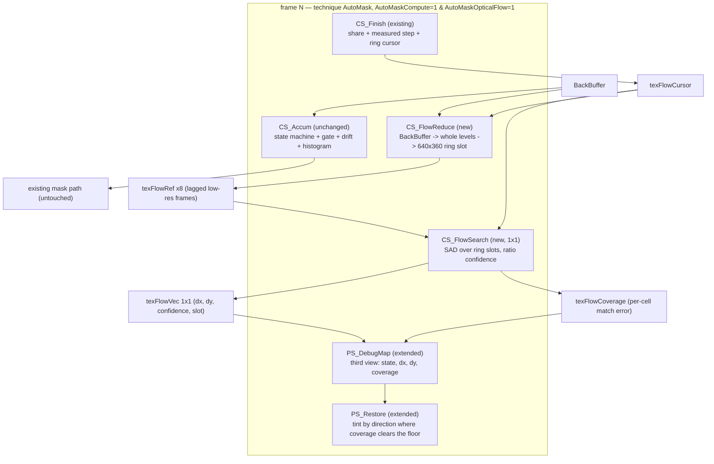

# Requirements

### Overview & Goals

Implement **the first step of `docs/optical-flow.md`** — §6.1's cheap decisive experiment, not the feature. The review concluded that a region motion estimate is applicable in principle but is a *fourth signal* that supports the verdict rather than replacing it, and that the two questions its synthetic model cannot answer are:

1. **Does the actual skybox produce a coherent global translation at all?**
2. **Is that estimate stable frame to frame?**

This plan builds the instrument that answers them: one **global low-resolution translation estimate per frame over a ring of lagged baselines**, packed onto the diagnostics overlay so it can be watched against a real panning sky. If either answer is no, §6.2 says the rest is not worth building — which is exactly why this step is deliberately small, additive and disposable.

### Scope

**In scope**
- Recording the reversal: `.junie/plans/automask-compute-gate-and-drift-channel.md` scopes "Block matching / optical flow" out, and `docs/optical-flow.md` §6 requires the reversal to be recorded as one rather than slipped in.
- A fourth structural switch, `AutoMaskOpticalFlow`, nested inside the compute guard and requiring `AutoMaskCompute=1` — guard owns its passes, its shaders and every target only they use (the repo's structural-switch rule).
- A low-resolution **ring of lagged reference frames** (8 slots, ~1/4 scale, a live frame-count stride so the baseline can be swept while watching).
- `CS_FlowReduce` (frame → ring slot, on the 8-bit whole-level grid the rest of the shader judges on) and `CS_FlowSearch` (SAD over a ±S low-res window, a **ratio/variance confidence** rather than "the minimum is zero", writing `dx`, `dy`, confidence and the winning slot, plus a per-pixel coverage map).
- A third diagnostics view that tints by **coverage-cleared region** in the estimated direction, so a coherent sky reads as one flat colour and a featureless region stays untinted — §4's patchiness, made visible.
- `tools/verify_shaders.py` variant coverage for the new switch so the probe's elision is proven, not assumed.
- `README.md` + `AGENTS.md`: the switch, the new view, and the honest statement that this is an instrument that is added rather than a replacement.

**Out of scope**
- The tile grid / per-region vectors (§5.3 explicitly gates region count on this experiment's outcome).
- The **baseline policy** (§3's loop failure needs an anchored estimate — a design decision, and §6.3 defers it until the estimate is shown to track). The ring only makes each candidate baseline *measurable*.
- Any change to the verdict: no vector feeds `AutoMaskMotion`, the accumulator, the drift channel or the mask. §5.1 is explicit that the estimate supports the premise rather than replacing the accumulator.
- The pixel path: the probe is compute-only, as chosen; `AutoMaskCompute=0` behaviour must stay byte-for-byte identical (proven by the verifier's entry-point hashes).
- The repeat detector of `docs/drift-snap-review.md` §5.1 — the competing remedy, not part of this step.
- Sub-pixel interpolation of the winning offset, and any per-pixel matching.

### User Stories

- As the shader's author, I want to see the sky's own translation vector drawn over the picture, so that I can tell whether my skybox produces a *coherent* estimate before anyone builds a signal on top of it.
- As the shader's author, I want to see how the estimate changes as the baseline lengthens, because §3's crux is that the match must be short enough to stay coherent and long enough to contain whole pixels — and which side my sky falls on is the one input the model could not supply.
- As the shader's author, I want to see where the estimate *fails* to be coherent — the featureless part of a sky — so that the expected patchiness of §4 is measured rather than discovered later in the mask.
- As a user, I want the default build to be untouched: the fourth switch off costs no memory and no passes, and the pixel path is not affected at all.

### Functional Requirements

- `AutoMaskOpticalFlow=0` (default): no probe targets declared, no probe passes in the technique, and the entry points of all four `AutoMaskCompute=0` variants hash byte-for-byte as before.
- `AutoMaskOpticalFlow=1` requires `AutoMaskCompute=1`. With compute off the feature is absent and the file compiles as the pixel path — that combination is one of the compiled variants rather than a documented hope.
- The probe runs every frame: the current frame reduced into the ring slot for the current frame index, then one global SAD search over the ring's lagged candidates.
- The estimate is reported as `(dx, dy, confidence, winning slot)` and is never written back into any existing target, uniform or verdict.
- The new overlay view tints *only* the pixels whose low-resolution cell clears a live coverage floor, in the direction the estimate reports, and leaves every other pixel exactly as the game drew it — the same contract the other two views keep.
- The corner marker keeps its meaning in all three views, magenta/yellow, unaffected by which view is selected.
- New uniforms follow the widget-family convention: frame counts are `__UNIFORM_SLIDER_FLOAT1`, booleans `__UNIFORM_SLIDER_BOOL1`; the baseline stride is a slider and not a drag, because it is a frame count rather than a duration.
- Because the probe cannot be part of the mask, the README says plainly that this is a measuring feature whose estimate does nothing but draw.

### Non-Functional Requirements

- **Cost:** the ring is ~8 slots × 640×360 RGBA8 ≈ **7 MB**, and the work is one full-res read plus a small reduction per frame and a bounded search — roughly 10⁵ low-resolution taps, against `CS_Accum`'s existing 154 slots. It is an **addition**, and the README must not claim a replacement (the drift channel's cost claim already had to be corrected once).
- **Resolution is a design constraint, not a detail.** The search can only see a shift of one ring pixel or more, so at 1/4 scale the smallest findable move is ~4 screen px; the doc's assumption that "the existing pipeline already downsamples for the gate" is stale, because the compute path's 16×16 coarse grid was *removed*, and 16×16 would be far too coarse to match in anyway.
- **Platform:** compute-only, so D3D11+/Vulkan, exactly as the compute path already states; the switch tooltip must say so.
- Toggling the switch costs one effect recompile, as with the other three.


# Technical Design

### Current Implementation

- `Shaders/AutoMask.fx` (796 lines): `AutoMaskCompute` guard from line 243 owns the compute targets; `CS_Accum` (line 295, `[numthreads(64,4,1)]`, `tex2Dlod`/`tex2Dfetch`/`tex2Dstore`, bounds predicate) and `CS_Finish` (line 420, 1×1) do the accumulator's work, the exact gate, the histogram and the drift channel. Technique `AutoMask` swaps pass entries per variant from line 708. `PS_CopyDrift` (line 454) is the pixel-side ping-pong back-edge pattern a new copy pass would follow if one is needed.
- Diagnostics: `texAutoDebug` is `BUFFER_WIDTH×BUFFER_HEIGHT` `RGBA8` (line 281); `PS_DebugMap` (line 655) packs `.r` = graded motion, `.g`/`.b` = the same verdict value, `.a` = the screen state, picked by the live bool `UIDebugMotion` (line 637). `PS_Restore` (line 667) tints over the restore with `UIDebugMotion ? red : green`, blends by the signal so unnamed pixels pass through, draws the deadzone ring, and reads the screen state from `tex2D(AutoDebug, float2(0.5,0.5)).a` for the bottom-left marker (line 694).
- The file's conventions that constrain any probe: `tex2D` is rejected at `cs_5_0` (X4532) so compute passes use `tex2Dlod`; a barrier needs uniform flow control so the ceil-div guard is a predicate (X4026); `groupshared` is file-scope; a `storage2D` cannot be indexed, so access is `tex2Dfetch`/`tex2Dstore` and atomics take (storage, coord); dialect spellings are pinned in the checker; `BUFFER_*` stays buffer-relative; every pass keeps `float4 pos : SV_Position` first.
- `tools/verify_shaders.py` (764 lines): `BASE_VARIANTS` four combos, `VARIANTS` = base × `AutoMaskCompute` 0/1 = eight; `PIXEL_ENTRY_POINT`/`COMPUTE_ENTRY_POINT`/`COMPUTE_ENTRY_POINT_THREADED` decide the profile (`ps_5_0`/`cs_5_0`); `STORAGE`/`STORAGE_ACCESS`/`ATOMIC`/`BARRIERS` are translated by `strip_for_fxc` (so a translated spelling is unverifiable by compiling — hence the pinned-spelling and bracket-form loud failures); `--pass-list`, `--opcodes`, `--hashes` exist.

### Key Decisions

1. **Fourth structural switch, nested inside the compute guard.** `AutoMaskOpticalFlow` follows the `#ifndef` + `// [0 or 1]` convention and owns its passes, its shaders and every target only it uses. Its body lives inside `#if AutoMaskCompute == 1`, so `AutoMaskOpticalFlow=1` with compute off is simply the pixel path — a variant that gets compiled rather than a documented hope.
2. **A ring of lagged low-resolution frames, each slot a real past frame.** Eight slots at ~1/4 scale (640×360 `RGBA8`, quantized to whole levels like every other comparison here), slot *i* holding the frame `(i+1) × stride` frames back. Real stored frames are what make §3's tension measurable: a blended average (the drift store) would confound "the match degraded" with "the reference is a blend".
3. **The baseline is swept live, and the ring index is one frame behind.** `AutoMaskFlowStride` is a live frame-count slider (`__UNIFORM_SLIDER_FLOAT1`, declared inside the flow guard beside the horizon for the same reason), because sweeping the baseline *is* the experiment. The ring cursor is advanced in `CS_Finish`, the one 1×1 pass that already exists, so the reduce pass reads it one frame behind — the same one-frame-behind convention the share and the measured step already use, and harmless for a ring.
4. **Confidence is a ratio with a variance floor, never the SAD minimum.** §7 is explicit that the minimum is zero at *every* offset over a pure gradient while the offset found there is wrong, so the reading is `best / second-best` at a different offset with a low-variance rejection. This is what makes the overlay's *untinted* regions honest (they are rejected matches, not zero-confidence noise) and it is the only part of the probe that must be right for the patchiness of §4 to mean anything.
5. **The winning slot is reported, not just the vector.** "Is the estimate stable frame to frame" (§6.2) is answered partly by which lag produced the match: a stable short baseline and an unstable long one is the expected signature, and it is the evidence §6.3's deferred policy needs. So the readout target carries the winning slot alongside `dx`, `dy` and confidence.
6. **Per-view packing of the existing debug target, and a three-position view slider.** `UIDebugMotion` (a bool) cannot express three views, so it becomes a `__UNIFORM_SLIDER_FLOAT1` view selector (0 motion, 1 verdict, 2 flow) — a live panel change documented in the README, and a smaller change than adding a second bool that would have a meaningless fourth state. Each view keeps its own packing of `texAutoDebug` (the existing precedent: two channels for one value because the view reads one or the other), so the flow view packs `.r` = screen state, `.g`/`.b` = quantized `dx`/`dy`, `.a` = coverage. That is the one place a *guarded read line* is genuinely needed — the corner marker reads the state from `.a` today and must read `.r` in the flow view — unlike the `MotionStat` case, where renaming the declaration per variant kept the read sites untouched.
7. **A live coverage floor, so §4 is measured rather than assumed.** `UIDebugCoverageFloor` (`__UNIFORM_SLIDER_FLOAT1`, diagnostics + flow guarded) sets the match-quality bar the tint honours; sweeping it shows the featureless/flat split directly, which is the same instrument discipline the auto-deadband used.
8. **Nothing is wired into the verdict.** No line of `CS_Accum`'s state machine, the gate, the drift channel or the mask reads the probe. This keeps the change additive and reviewable, and keeps §6.3's decisions (baseline policy, region count) genuinely open.

### Proposed Changes

**Probe shape (all inside the `AutoMaskOpticalFlow` guard, which is inside the compute guard):**

- Targets: `texFlowRef` (0..7) 640×360 `RGBA8` ring + samplers; `texFlowVec` 1×1 `RGBA32F` + storage (`dx`, `dy`, confidence, winning slot); `texFlowCoverage` low-res `R8` (a cell per ~16 screen px) + sampler; `texFlowCursor` 1×1 `r32u` + storage (ring index). All point-filtered, as data rather than pictures, following the drift samplers' precedent.
- `CS_FlowReduce` (one dispatch per frame): sample `BackBuffer` by `tex2Dlod`, quantize to whole levels (`round(c*255)`), write into ring slot `cursor` — the same grid the accumulator judges on, so the search is matching the same signal the shader already reads.
- `CS_FlowSearch` (1×1 dispatch, after `CS_FlowReduce`): for the newest slot first and then older ones, SAD over `(2S+1)²` offsets of ±S low-res px against a fixed low-res patch; keep the best and second-best offsets; derive confidence from the ratio with a variance floor; write `dx`, `dy`, confidence and the winning slot into `texFlowVec`, and write the per-cell match error at the winning offset into `texFlowCoverage` (one more subtraction at the winning offset, which is what makes the tint a *coverage* reading rather than a flat wash).
- `CS_Finish` (existing 1×1 pass): one guarded `tex2Dfetch`/`tex2Dstore` pair advancing `texFlowCursor` by one.
- Technique `AutoMask`: two guarded pass entries in the compute branch, after `CS_Accum` and before `CS_Finish`, so the probe reads the frame the accumulator read and the reduced reference is the frame just stored. No change to any existing pass entry.

**Diagnostics:**

- `PS_DebugMap`: a guarded third branch (flow view) writing the flow packing; the motion and verdict branches are unchanged.
- `PS_Restore`: the tint selector becomes a three-way branch — the flow view's mark colour is derived from the packed direction and blended by packed coverage, so a rejected/flat region stays untouched; the corner marker's state read is guarded to `.r` in the flow view and stays `.a` otherwise.
- `UIDebugMotion` → `UIDebugView` (0/1/2), plus `UIDebugCoverageFloor`; both guarded by `AutoMaskDiagnostics` with the flow view additionally guarded by `AutoMaskOpticalFlow`, and the README's `Diagnostics: motion view` row rewritten as the view selector.

### Data Models / Contracts

```hlsl
// Switch (fourth, after AutoMaskCompute)
#ifndef AutoMaskOpticalFlow
	#define AutoMaskOpticalFlow	0	// [0 or 1] 1 draws a low-resolution motion estimate from the
#endif							// image alone (needs AutoMaskCompute=1; D3D11+/Vulkan)

#if AutoMaskCompute == 1 && AutoMaskOpticalFlow == 1
	uniform float AutoMaskFlowStride < __UNIFORM_SLIDER_FLOAT1
		"Frames between ring slots"; ui_min 4.0; ui_max 64.0; ui_step 1.0; > = 16.0;

	#define FLOW_RING 8
	texture texFlowRef { Width = 640; Height = 360; Format = RGBA8; };   // × FLOW_RING, one slot per texture
	sampler FlowRef { Texture = texFlowRef; MinFilter = POINT; MagFilter = POINT; MipFilter = POINT; };
	texture texFlowVec { Width = 1; Height = 1; Format = RGBA32F; };     // .x=dx .y=dy .z=confidence .w=slot
	storage2D<float4> FlowVecStore { Texture = texFlowVec; };
	texture texFlowCursor { Width = 1; Height = 1; Format = r32u; };
	storage2D<uint> FlowCursor { Texture = texFlowCursor; };
	texture texFlowCoverage { Width = 40; Height = 23; Format = R8; };   // per-cell match error at the winning offset
	sampler FlowCoverage { Texture = texFlowCoverage; };
#endif

// Access rules this guard must obey (already learned here the hard way):
//   tex2Dlod, never tex2D, at cs_5_0; bounds guard is a predicate, not a return;
//   tex2Dfetch / tex2Dstore only -- a storage object cannot be indexed;
//   atomicAdd(storage, coord, value) stays as it is.

// Pass wiring (technique AutoMask, compute + flow variant):
// CS_Accum -> PS_Copy -> PS_CopyDrift -> CS_FlowReduce -> CS_FlowSearch -> CS_Finish
//          -> PS_DilateH -> PS_DilateV -> PS_Store -> PS_StoreFrame -> [PS_AntiBloom] -> [PS_DebugMap]
//
// Debug view packing, per view (texAutoDebug RGBA8):
//   motion   .r=graded motion   .g/.b=verdict   .a=screen state
//   verdict  .r=graded motion   .g/.b=verdict   .a=screen state
//   flow     .r=screen state    .g=dx code     .b=dy code   .a=coverage
```

Dispatch shapes stay buffer-relative and ceil-div, with in-shader bounds predicates: `CS_FlowReduce` from `BUFFER_WIDTH`/`BUFFER_HEIGHT`, `CS_FlowSearch` a 1×1 dispatch. The ring's slot textures are declared individually (no texture arrays) because ReShade's dialect has no array-of-target form here; the slot is selected by a guarded branch on `cursor`.

### Components

| Component | Kind | Change |
| --- | --- | --- |
| `CS_Accum`, `CS_Finish`, `PS_Copy`, dilate/store/anti-bloom | compute / pixel | unchanged in behaviour; `CS_Finish` gains one guarded cursor advance |
| `CS_FlowReduce` | compute (new) | frame → low-res whole-level ring slot |
| `CS_FlowSearch` | compute (new, 1×1) | ring SAD, ratio confidence, `dx`/`dy`/slot out, coverage map out |
| `PS_DebugMap` | pixel | third view branch |
| `PS_Restore` | pixel | three-way tint selector; guarded marker state read |
| `UIDebugMotion` | uniform | becomes `UIDebugView` 0/1/2 |
| `AutoMaskFlowStride`, `UIDebugCoverageFloor` | uniforms (new) | guarded; slider family |
| `tools/verify_shaders.py` | tool | variant coverage for the fourth switch |

### File Structure

- `Shaders/AutoMask.fx` — the guard, two compute shaders, the targets, the two diagnostics branches. No new file and **no `.fxh` companion**, per the repo's rule.
- `tools/verify_shaders.py` — `BASE_VARIANTS`/`VARIANTS` extended so flow is crossed in with compute on; no new translation, since the probe adds no new dialect spelling.
- `README.md` — the switch, the view selector's third position, the coverage floor, and the plain statement that this draws a measurement and does nothing else.
- `AGENTS.md` — the switch inventory becomes four, plus a short paragraph on the probe in the compute-path section.
- `docs/optical-flow.md` — a recorded adoption note; `.junie/plans/automask-compute-gate-and-drift-channel.md` — the out-of-scope entry reworded so the reversal is visible.

### Architecture Diagram



### Risks

- **The resolution makes the signal disappear.** A reduction to the 16×16 grid the doc assumes would put a whole-pixel shift far outside the search window; the ~1/4 scale ring is what keeps a 4 screen px move findable. Mitigation: the scale is fixed at ~1/4 and the constraint is written into the shader comment and the README, not left implicit.
- **The ring is a real cost for a disposable probe** (~7 MB plus a reduction and a search per frame) and the doc warns explicitly that the drift channel's cost claim already had to be walked back. Mitigation: the guard elides everything when off, the cost is stated as an addition in the README, and instruction counts are recorded for the new passes.
- **A looping animation matches at zero offset** — §3's correctness failure, which this step does *not* fix. Mitigation: it is measurable rather than hidden, because the winning slot is reported: a loop reads as a confident `(0,0)` on long baselines, and that signature is what §6.3's policy decision will have to answer.
- **Flat regions produce confident nonsense.** Mitigation: the ratio test with a variance floor (§7), and the coverage floor on the view, so rejected cells stay untinted instead of being painted a direction.
- **Changing `UIDebugMotion` touches an existing user-facing control.** Mitigation: it is a three-position selector whose 0/1 positions keep the existing meanings, the README row is rewritten, and the marker is verified in all three views.
- **Dialect traps re-introduced.** Mitigation: every rule already learned here (predicate guard, `tex2Dlod`, `storage2D` capital letter, `tex2Dfetch`/`tex2Dstore`, no bracket indexing) is honoured by design, and the checker's loud failures for the pinned spellings and the bracket form are re-exercised by hand.

# Testing

### Validation Approach

Per `AGENTS.md`, verification is the offline compile check plus a review pass; real end-to-end behaviour needs eyes in ReShade on a game, which is stated rather than claimed. This feature is *only* meaningful in ReShade, so the manual list carries most of the weight and must be reported as outstanding, not passed.

**Automated (agent-runnable)**

- `uv run tools/verify_shaders.py init && uv run tools/verify_shaders.py check --pass-list --opcodes` after every stage: all variants pass, including the new flow ones.
- **Off-path regression, the strongest available proof:** bytecode sha256 of every entry point in the four `AutoMaskCompute=0` variants must be identical to the current baseline (`--hashes`), captured before the first shader edit. The probe must be invisible to the pixel path.
- **Elision proof:** `--pass-list` must show no probe pass at `AutoMaskOpticalFlow=0`, the two probe passes in the right slot at `AutoMaskOpticalFlow=1` + compute on, and the plain pixel path at `AutoMaskOpticalFlow=1` + compute off.
- **Guard-drop proof:** the variant matrix crosses flow in with compute on for all four base combos, so a nested guard that silently drops a pass or a target cannot hide behind another switch's setting.
- **Loud failures re-exercised by hand** if the checker is touched at all, plus the pinned-spelling and bracket-form guards, since nothing in the probe may introduce an untranslated dialect construct that the check would then compile past.
- Cost recorded in the stage summary: instruction counts for `CS_FlowReduce`/`CS_FlowSearch` and the target memory the guard allocates.

**Manual (needs eyes in ReShade — listed, not claimed)**

- **A slow sky pan with the flow view on:** the sky should read as one flat tinted colour (a coherent global vector), and the HUD should be visibly outside it. This is §6.2's existence question.
- **Stability:** the same pan held steady — the tint must not flicker between directions, and the reported winning slot must not jump between baselines frame to frame. This is §6.2's second question.
- **Baseline sweep:** raise `AutoMaskFlowStride` and watch the winning slot and the confidence; the expected signature is a short baseline matching confidently and long baselines degrading — and on a *looping* sky, a long baseline reading a confident `(0,0)`, which is §3's failure made visible.
- **Featureless sky:** a flat gradient region must stay untinted at any coverage floor, and sweeping `UIDebugCoverageFloor` must move the boundary between tinted and untinted — §4's patchiness as a measured distribution rather than a surprise in the mask.
- **No verdict change:** with the probe on, the mask must behave exactly as it does today in every one of the existing scenarios (walking with a HUD, a menu open/close, a quiet room, a scene cut, a moving element falling out, the marker's magenta/yellow). Any difference is a defect in this step, not a tuning outcome.
- **The three diagnostics views:** 0 and 1 must be unchanged from today; 2 must tint by direction with the marker reading magenta/yellow exactly as in the other two, and the deadzone ring must still draw.
- **Switch off:** the panel's flow settings disappear and behaviour and memory are as before; the pixel path is unaffected in every scenario.

# Delivery Steps

### ✓ Step 1: Record the reversal and add the guarded switch skeleton
The optical-flow path is recorded as a deliberate reversal, and `AutoMaskOpticalFlow` exists as a fourth structural switch that owns its own targets and passes.

**Status: done, committed as `record the optical-flow reversal and add its guarded switch`.** The reversal is recorded in `.junie/plans/automask-compute-gate-and-drift-channel.md`, the adoption note is in `docs/optical-flow.md`, and `Shaders/AutoMask.fx` carries the `#ifndef`-guarded `AutoMaskOpticalFlow` switch, `AutoMaskFlowStride`, and the probe's targets inside `#if AutoMaskCompute == 1 && AutoMaskOpticalFlow == 1`. The check's baseline was captured before the shader edit (`tools/.work/baseline_hashes.txt`) and the eight original variants still hash byte-for-byte as captured.

- Reword the "Block matching / optical flow" entry under *Out of scope* in `.junie/plans/automask-compute-gate-and-drift-channel.md` so the reversal is visible rather than silent.
- Add a short adoption note to `docs/optical-flow.md` recording the decision and stating that step one is the instrument of §6.1, not the feature.
- Add the `AutoMaskOpticalFlow` switch block to `Shaders/AutoMask.fx` after `AutoMaskCompute`, same `#ifndef` + `// [0 or 1]` convention, tooltip naming the D3D11+/Vulkan requirement and the dependency on the compute path.
- Nest its body inside `#if AutoMaskCompute == 1`, so `AutoMaskOpticalFlow=1` with compute off compiles as the plain pixel path (documented in the tooltip and the README).
- Declare the probe's targets inside the guard only: the eight-slot `texFlowRef` ring at 640×360 `RGBA8` with point-filtered samplers, `texFlowVec` 1×1 `RGBA32F` + storage, `texFlowCursor` 1×1 `r32u` + storage, `texFlowCoverage` low-res `R8` + sampler.
- Declare `AutoMaskFlowStride` inside the guard beside the drift horizon, as a `__UNIFORM_SLIDER_FLOAT1` frame count, with the comment explaining why the ring exists and why the scale is ~1/4 rather than the coarse grid.
- Update the `AGENTS.md` structural-switch inventory to four and record the check's baseline: capture `--hashes` output for all eight current variants before any shader edit.
- Verify: `uv run tools/verify_shaders.py check --pass-list --opcodes` passes with the switch off, and the four `AutoMaskCompute=0` variants still hash byte-for-byte as captured.

### ✓ Step 2: Teach the verifier the fourth switch
`tools/verify_shaders.py` compiles the probe variants, so the guard's elision is proven rather than assumed.

**Status: done.** `VARIANTS` is now the full crossing of the four `BASE_VARIANTS` with `AutoMaskCompute` and `AutoMaskOpticalFlow` — sixteen variants, the original eight keeping their names and hashes. The matrix is a comprehension over a `flow` axis added beside `compute`, so `-flow` at compute off compiles as the plain pixel path (the nested guard's negative control, asserted as wiring as well as by hash). A duplicate variant name — the shape a changed matrix can take, since the names are concatenated suffixes — now exits at import rather than showing one combination twice. Evidence: all sixteen pass `check --pass-list --opcodes --hashes`; the 80 off-path entry points hash byte-for-byte as captured before the shader edit, and the four `-flow` variants with compute off hash identically to their flow-off twins, so the nested guard is proven to elide to the plain pixel path rather than merely documented as doing so; the loud-failure set is fourteen cases, all holding, with the duplicate-name guard exercised by hand alongside the five that predate it. Nothing in the probe introduces a new dialect spelling, so the translation and its pinned-spelling guards are untouched.

- Extend the variant matrix so `AutoMaskOpticalFlow` is crossed in with `AutoMaskCompute=1` for all four `BASE_VARIANTS`, keeping the existing eight unchanged — the flow variants are additions, not a replacement of the existing coverage.
- Include the `AutoMaskOpticalFlow=1` with compute off combination, so the nested guard's behaviour there is compiled rather than assumed.
- Confirm the existing guards cover what the probe needs: a compute pass missing a `DispatchSize` still exits non-zero, a storage indexed with brackets is still a loud failure, and the pinned dialect spellings still refuse a lowercased near-miss (the probe introduces no new spelling, so nothing new is translated).
- Re-exercise the tool's loud-failure cases by hand after the matrix change, since a changed variant list is exactly where a silently skipped variant could hide.
- Verify: all flow variants pass, `--pass-list` shows the pixel path at flow-on/compute-off and no probe pass at flow-off, and the captured off-path hashes are unchanged.

###   Step 3: Implement the low-resolution ring and its reduction pass
With the probe on, each frame's picture is reduced onto the whole-level grid and stored into a lagged ring slot, with the cursor advanced one frame behind.

- Write `CS_FlowReduce`: `[numthreads(64,4,1)]` with ceil-div dispatch sizes from `BUFFER_WIDTH`/`BUFFER_HEIGHT`, sampling `BackBuffer` through `tex2Dlod` with an explicit level, quantizing to whole levels with `round(c*255.0)` (the grid the accumulator and the drift comparison already judge on), and writing `tex2Dstore` into the ring slot named by the cursor.
- Add the bounds predicate (`bool live = tid.x < ... && tid.y < ...`) rather than an early `return` — the file's X4026 constraint — and gate the store on it.
- Select the ring slot with a guarded branch on the cursor value; no texture-array indexing, and no bracket indexing of the storage anywhere.
- Advance the cursor in the existing `CS_Finish` pass with one guarded `tex2Dfetch`/`tex2Dstore` pair, so no new 1×1 pass is added and the reduce pass reads the cursor one frame behind — the same one-frame-behind convention the share and the measured step use.
- Add the two guarded pass entries to the compute branch of technique `AutoMask`, after `CS_Accum`, with `DispatchSizeX/Y` declared from the buffer size.
- Verify: all variants compile, `--pass-list` shows the reduction pass in the right slot only when both switches are on, the reduce pass's instructions are recorded, and the off-path entry-point hashes are still identical.

###   Step 4: Implement the ring search and the vector readout
The probe reports one global translation estimate per frame, with a ratio-based confidence, the winning baseline and a per-cell coverage map.

- Write `CS_FlowSearch` as a 1×1 dispatch, walking the ring from the newest slot towards the oldest and returning the best and second-best SAD offsets rather than only the minimum.
- Implement the confidence as the ratio of best to second-best at a *different* offset, with a variance floor rejecting low-contrast patches — the SAD minimum alone is zero at every offset over a pure gradient (§7), so the minimum is not the reading.
- Write `dx`, `dy`, the confidence and the winning slot into `texFlowVec` through `tex2Dstore`, and write the per-cell match error at the winning offset into `texFlowCoverage`, which is what makes the overlay tint a coverage reading rather than a flat wash.
- Keep every sample named at an explicit level (`tex2Dlod`), since the pass runs at `cs_5_0`, and keep all accesses on `tex2Dfetch`/`tex2Dstore`.
- Leave the verdict alone: no line of `CS_Accum`'s state machine, the gate, the drift channel, the histogram or the mask reads the probe.
- Verify: all variants compile, the probe targets appear only when both switches are on, instruction counts for the search are recorded, and the four off-path variants still hash identically.

###   Step 5: Put the estimate on the overlay in a third diagnostics view
The estimate is visible: a third view tints the picture in the estimated direction wherever the match is trustworthy, so a coherent sky reads as one flat colour and a featureless region stays untouched.

- Convert `UIDebugMotion` into `UIDebugView`, a `__UNIFORM_SLIDER_FLOAT1` selector with 0 = motion and 1 = verdict keeping their existing meanings and 2 = the flow view.
- Add `UIDebugCoverageFloor` (`__UNIFORM_SLIDER_FLOAT1`) so the tint's match-quality bar can be swept live, showing §4's split as a moving boundary rather than a surprise in the mask.
- Extend `PS_DebugMap` with a guarded flow branch packing the view's own convention into `texAutoDebug`: `.r` = screen state, `.g`/`.b` = quantized `dx`/`dy`, `.a` = coverage; the motion and verdict branches are untouched.
- Extend `PS_Restore` to a three-way tint selector, deriving the flow view's mark colour from the packed direction and blending it by packed coverage so rejected cells pass through untouched.
- Guard the corner marker's state read for the flow view (it reads `.a` today and must read `.r` there), and confirm the deadzone ring still draws over the new view.
- Update `README.md` in its existing voice: the third view position, the baseline-stride and coverage-floor settings, why the estimate exists as a measurement, and the plain statement that it does nothing but draw.
- Update `AGENTS.md`'s compute-path section and diagnostics paragraph to describe the probe, and record the manual scenarios that need eyes in ReShade (slow pan coherence, stability, baseline sweep, featureless sky, unchanged mask, all three views) as outstanding rather than verified.
- Verify: all variants pass, the off-path hashes are unchanged, and the manual list is reported as the remaining evidence.